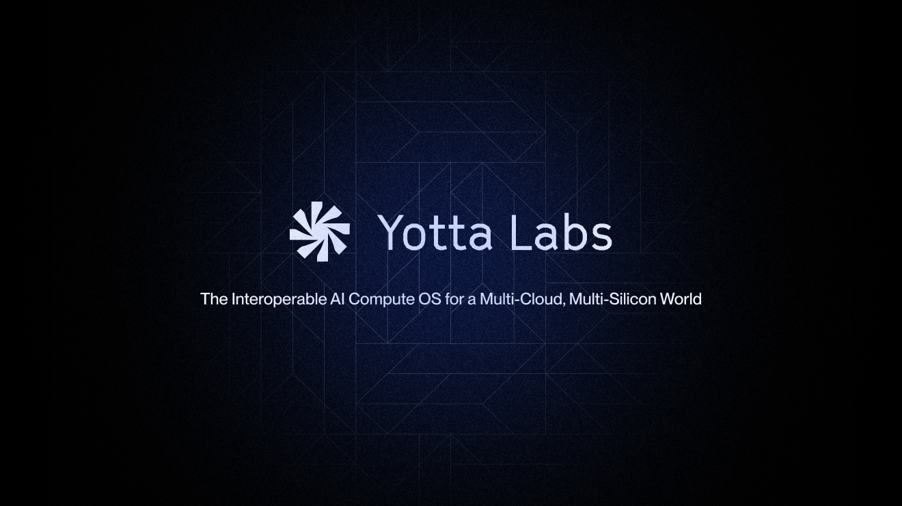

# About

### TL;DR

**Yotta Labs is building an interoperable AI infrastructure operating system that orchestrates workloads across multi-cloud and multi-silicon environments — unifying fragmented GPU capacity into a single execution fabric for production AI.**

<figure><figcaption></figcaption></figure>

### The Problem: Fragmented AI Compute

AI compute is no longer scarce — it is fragmented. Modern AI workloads are constrained by infrastructure fragmentation across:

* **Cloud providers** with incompatible APIs and pricing models
* **Geographic regions** with uneven capacity, electricity price, and availability
* **Silicon architectures**, including NVIDIA, AMD, and emerging accelerators, each with distinct software stacks and performance characteristics

As accelerators diversify and workloads scale, teams are forced to make early, irreversible infrastructure decisions — often optimizing for a single vendor at the cost of flexibility, utilization, and long-term efficiency.

The result is low GPU utilization, rising operational complexity, and slower deployment cycles for real-world AI systems.

### Our Solution: An Interoperable AI Infrastructure OS

Yotta Labs is building the systems layer that makes heterogeneous AI infrastructure work as one.

At its core, Yotta provides a **unified execution and orchestration control plane** that abstracts differences across clouds and GPU architectures, allowing AI workloads to be scheduled, deployed, and optimized consistently across diverse environments.

Instead of treating infrastructure heterogeneity as an edge case, Yotta is designed for it — enabling AI workloads to move fluidly across providers, regions, and silicon generations.

### What Yotta Enables

With Yotta, teams can:

* **Run production inference and selective training across multi-cloud environments** through a single control plane
* **Treat multi-silicon infrastructure as a first-class capability**, not a compatibility challenge
* **Improve GPU utilization and cost efficiency** by matching workloads to the right hardware at the right time
* **Avoid long-term vendor lock-in** while maintaining production-grade reliability and performance

Yotta is built for teams deploying real AI systems — not experiments, demos, or single-vendor pipelines.

### Core Capabilities

#### Multi-Cloud, Multi-Silicon Orchestration

Deploy and scale AI workloads across clouds and heterogeneous GPU architectures without rewriting infrastructure logic.

#### Execution-Layer Abstraction

Decouple AI workloads from vendor-specific hardware constraints, enabling consistent execution across NVIDIA, AMD, and emerging accelerators.

#### Hardware-Aware Scheduling

Place workloads based on real performance characteristics, availability, and utilization across diverse GPU fleets.

#### Production-First Design

Built for reliability, observability, and operational control required by enterprise and AI-native production environments.

### Why It Matters

The future of AI infrastructure is not defined by a single cloud or a single chip.

As accelerator ecosystems diversify and compute demand accelerates, the winning platforms will be those that treat **silicon as a variable, not a constraint**.

Yotta Labs is building the execution layer that allows AI workloads to outlive hardware cycles, adapt to new accelerators, and scale across an increasingly heterogeneous global compute landscape.

### Where We’re Headed

Our long-term vision is to make AI compute **interoperable, elastic, and efficient by default** — turning fragmented GPU infrastructure into a unified, schedulable resource for the next generation of AI applications.

Yotta is the operating system for that future.
