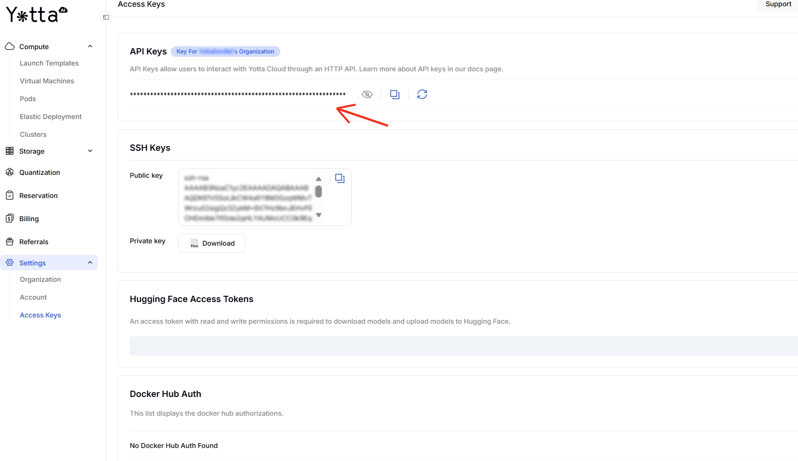

# API Keys

### What is an API Key

An API key is a unique credential that authenticates your requests and operations within the Yottalabs AI Platform.

### How to Access Your Own API Keys

Launch Console -> Settings -> Access Keys

<figure><figcaption></figcaption></figure>

### When You'll Need API Keys

#### Authorizing API Requests

All endpoints require API key authentication via the `X-Api-Key` header:

```
 X-Api-Key: {X-Api-Key}
```

**How to Use**:

Include headers in your endpoint requests, for example:

```json
curl -X POST https://api.yottalabs.ai/v2/pods \
  -H "X-Api-Key: {your-x-api-key}" \
  -H "Content-Type: application/json" \
  -d '{
    "name": "test-pod",
    "image": "yottalabsai/pytorch:2.9.0-py3.11-cuda12.8.1-cudnn-devel-ubuntu22.04",
    "gpuType": "NVIDIA_RTX_4090_24G",
    "gpuCount": 1,
    "containerVolumeInGb": 50,
    "regions": ["us-east-1"],
    "minSingleCardVcpu": 8,
    "minSingleCardRamInGb": 32,
    "environmentVars": [
      {"key": "PYTHONUNBUFFERED", "value": "1"}
    ],
    "expose": [
      {"port": 8888, "protocol": "http"}
    ]
  }'
```


Pay special attention to your **API key security**.

Make sure to update credentials periodically for security

