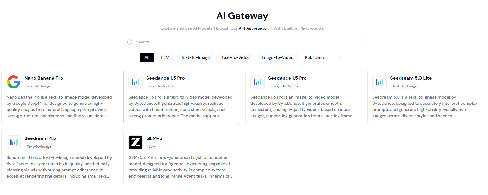
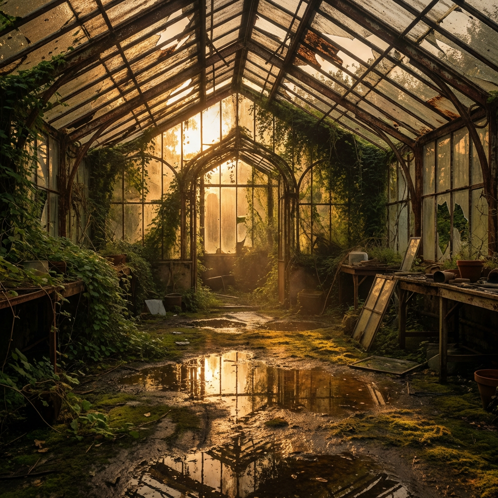
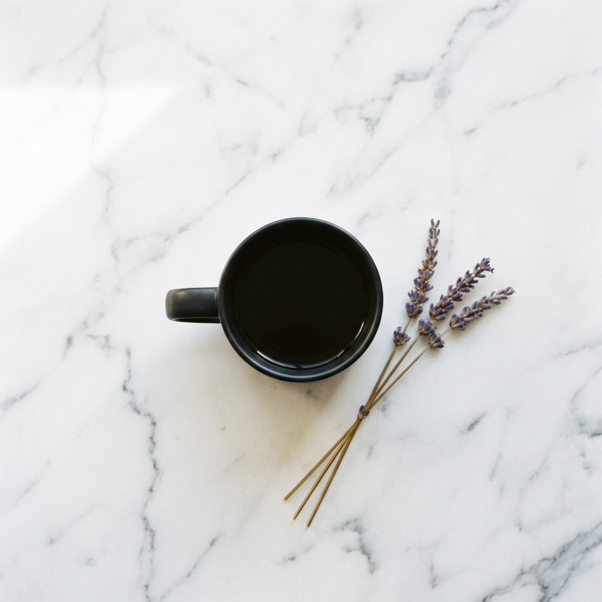

# AI Gateway

AI Gateway on Yottalabs is a unified API aggregator that brings together models from Google DeepMind, ByteDance, Z.AI, and more under one roof.

<figure><figcaption></figcaption></figure>

The category tabs at the top of the model list let you quickly filter models by type — choose from `All`, `LLM`, `Text-To-Image`, `Text-To-Video`, `Image-To-Video`, or browse by `Publishers` using the dropdown.

<figure><figcaption></figcaption></figure>

Simply click any tab to instantly narrow down the model catalog to what's relevant for your use case.

#### **Nano Banana Pro**

_**Google DeepMind**_ _`Text-To-Image`_

Nano Banana Pro is Google DeepMind's text-to-image model built for precision and versatility. Where a lot of image models struggle with complex, multi-element prompts or lose consistency across styles, Nano Banana Pro holds its ground — structural details stay sharp, fine visual elements render cleanly, and it handles everything from cinematic portraits to marketing assets well.

***

#### :banana:**Playground**

<figure><figcaption></figcaption></figure>

The Playground is your zero-setup sandbox. No API key configuration, no environment setup — just type a prompt and run it!

*   **Prompt**: Write in natural language. The more context you give it, the more controlled the output.

    *   **Template 1 — Portrait / Character**

        ```
        A [photo style] of a [subject description], wearing [clothing details], 
        [action/pose]. The background is [environment description]. 
        Lighting is [lighting type], creating a [mood/atmosphere] feel. 
        Shot with [lens/camera style], [color grade].
        ```

        _Example:_

        > A cinematic photograph of a young black woman wearing a casual t-shirt and shorts, standing still with a colorful beach cocktail in hand, grinning broadly at the camera. The background features a sun-drenched Hawaiian beach scattered with tropical flowers and coconuts.
        >
        > Lighting: bright, warm natural sunlight, creating an upbeat and joyful atmosphere.
        >
        > Lens: wide-angle, capturing the full environment around the subject to amplify the sense of openness and surprise.
        >
        > Color grade: oversaturated, vivid tropical palette — punchy greens, electric blues, warm yellows. High energy, vacation editorial style.
        >
        > 


    *   **Template 2 — Scene / Environment**

        ```
        A [render style] of [location/environment], during [time of day / weather]. 
        [Key visual elements present in the scene]. 
        The atmosphere is [descriptive mood]. 
        Color palette: [dominant colors]. Style reference: [art style or director/photographer].
        ```

        _Example:_

        > A photorealistic render of an abandoned greenhouse interior, during golden hour after light rain. Overgrown vines crawl across rusted iron frames, and puddles reflect warm light from broken roof panels. The atmosphere is quiet and melancholic. Color palette: amber, moss green, pale rust. Style reference: Gregory Crewdson.
        >
        > 


    *   **Template 3 — Product / Marketing Visual**

        ```
        A clean [shot type] of [product name/description] placed on [surface/background]. 
        [Props or surrounding elements if any]. 
        Lighting: [lighting setup]. 
        The overall tone is [brand tone: minimal / bold / luxury / playful]. 
        No text, no watermark.
        ```

        _Example:_

        > A clean overhead shot of a matte black coffee cup placed on a white marble surface. A single sprig of dried lavender rests beside it. Lighting: soft diffused natural light from the left. The overall tone is minimal and premium. No text, no watermark.
        >
        > 


        **Quick Reference — Power Words by Category**

        | Category    | Options                                                                      |
        | ----------- | ---------------------------------------------------------------------------- |
        | Photo style | cinematic, photorealistic, editorial, documentary, long-exposure             |
        | Lighting    | golden hour, blue hour, hard rim light, soft diffused, neon-lit, candlelit   |
        | Mood        | ethereal, gritty, melancholic, energetic, sterile, nostalgic                 |
        | Color grade | desaturated, warm analog, high contrast B\&W, teal & orange, pastel washed   |
        | Composition | wide establishing shot, tight close-up, bird's eye, Dutch angle, symmetrical |
* **Advanced Settings**: Expand this section to adjust parameters like output dimensions, sampling steps, or guidance scale, depending on what the provider exposes. Useful when you want to push quality or constrain style.
  *   **Aspect Ratio** defines the shape of your image.  `1:1` for social square posts, `9:16` for mobile/Stories, `16:9` for presentations and banners, `2:3` for portrait editorial, `21:9` for cinematic widescreen, and several others in between. The selected ratio is highlighted in black — default is `1:1`.


  *   **Resolution** sets the output quality: `1K`, `2K`, or `4K`. Higher resolution means more detail and larger file size. For quick prototyping, 1K is fine. For anything going into production — print, large-format display, or high-DPI screens — go 2K or 4K.


  * **Output Format** is straightforward: `PNG` for lossless quality with transparency support, `JPEG` for smaller file sizes when you don't need a transparent background. **When in doubt, PNG is the safer default.**

<figure><figcaption></figcaption></figure>


* **Run**: Hit **Run** to generate.
* **Output & Download**: Generated images render directly in the panel. Use the download icon in the top-right corner of the output to save your result locally.
* **Pricing**: Cost is shown transparently beneath the output — currently **$0.14 per image**. What you see is what you pay.

***

#### :banana:**Providers**

<figure><figcaption></figcaption></figure>

Different providers may vary in latency, throughput, or price. You don't need to manage any of this manually — Yotta Labs automatically routes your requests to the most suitable provider based on your prompt and parameters.

***

#### :banana:**API**

If you're integrating Nano Banana Pro into your own application, the API tab is your starting point. Authentication is handled via an `X-API-KEY` header — grab your key from your account settings and you're good to go.



#### **Copy the SDK Code**

Head to the **API** tab on the Nano Banana Pro model page. Copy the full Python SDK code provided.



#### **Save It Locally**

Open any text editor (Notepad, VS Code, or anything you have on hand). Paste the code in, then make two edits before saving:

* Replace `"MY API Key"` with your actual API key from the Dashboard. See our official doc for API key [here](https://docs.yottalabs.ai/yotta-labs/api-and-sdk/api-keys)
* Replace the default prompt with your own

Save the file as `run.py` in a folder of your choice, for example:

```
D:\python\ssh\run.py
```



#### **Run It from the Command Line**

Open **Command Prompt** (search "cmd" in the Windows Start menu). Navigate to the folder where you saved the file, then run it:

```bash
cd D:\python\ssh
python run.py
```

You'll see status updates printed in the terminal as the job processes:

<figure><figcaption></figcaption></figure>



#### **Copy the Output URL and Save Image**

Once the job completes, the terminal prints a URL starting with `https://`. Select and copy the full URL.

Paste the URL into your browser and hit Enter. The image will load directly in the browser.

<figure><figcaption></figcaption></figure>


