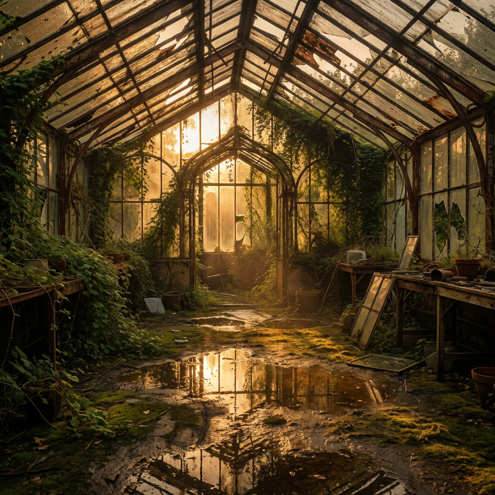

# AI Gateway

AI Gateway on Yottalabs is a unified API aggregator that brings together models from Google DeepMind, ByteDance, Z.AI, and more under one roof.

<figure><figcaption></figcaption></figure>

The category tabs at the top of the model list let you quickly filter models by type — choose from `All`, `LLM`, `Text-To-Image`, `Text-To-Video`, `Image-To-Video`, or browse by `Publishers` using the dropdown.

<figure><figcaption></figcaption></figure>

<figure><figcaption></figcaption></figure>


Simply click any tab to instantly narrow down the model catalog to what's relevant for your use case.

#### **Nano Banana Pro**

_**Google DeepMind**_ _`Text-To-Image`_

Nano Banana Pro is Google DeepMind's text-to-image model built for precision and versatility. Where a lot of image models struggle with complex, multi-element prompts or lose consistency across styles, Nano Banana Pro holds its ground — structural details stay sharp, fine visual elements render cleanly, and it handles everything from cinematic portraits to marketing assets well.

***

#### :banana:**Playground**

<figure><figcaption></figcaption></figure>

The Playground is your zero-setup sandbox. No API key configuration, no environment setup — just type a prompt and run it!

* **Prompt**: Write in natural language. The more context you give it, the more controlled the output.
  *   **Template 1 — Portrait / Character**

      ```
      A [photo style] of a [subject description], wearing [clothing details], 
      [action/pose]. The background is [environment description]. 
      Lighting is [lighting type], creating a [mood/atmosphere] feel. 
      Shot with [lens/camera style], [color grade].
      ```

      _Example:_

      > A cinematic photograph of a young black woman wearing a casual t-shirt and shorts, standing still with a colorful beach cocktail in hand, grinning broadly at the camera. The background features a sun-drenched Hawaiian beach scattered with tropical flowers and coconuts.
      >
      > Lighting: bright, warm natural sunlight, creating an upbeat and joyful atmosphere.
      >
      > Lens: wide-angle, capturing the full environment around the subject to amplify the sense of openness and surprise.
      >
      > Color grade: oversaturated, vivid tropical palette — punchy greens, electric blues, warm yellows. High energy, vacation editorial style.
      >
      > 
  *   **Template 2 — Scene / Environment**

      ```
      A [render style] of [location/environment], during [time of day / weather]. 
      [Key visual elements present in the scene]. 
      The atmosphere is [descriptive mood]. 
      Color palette: [dominant colors]. Style reference: [art style or director/photographer].
      ```

      _Example:_

      > A photorealistic render of an abandoned greenhouse interior, during golden hour after light rain. Overgrown vines crawl across rusted iron frames, and puddles reflect warm light from broken roof panels. The atmosphere is quiet and melancholic. Color palette: amber, moss green, pale rust. Style reference: Gregory Crewdson.
      >
      > 
  *   **Template 3 — Product / Marketing Visual**

      ```
      A clean [shot type] of [product name/description] placed on [surface/background]. 
      [Props or surrounding elements if any]. 
      Lighting: [lighting setup]. 
      The overall tone is [brand tone: minimal / bold / luxury / playful]. 
      No text, no watermark.
      ```

      _Example:_

      > A clean overhead shot of a matte black coffee cup placed on a white marble surface. A single sprig of dried lavender rests beside it. Lighting: soft diffused natural light from the left. The overall tone is minimal and premium. No text, no watermark.
      >
      > 

      **Quick Reference — Power Words by Category**

      | Category    | Options                                                                      |
      | ----------- | ---------------------------------------------------------------------------- |
      | Photo style | cinematic, photorealistic, editorial, documentary, long-exposure             |
      | Lighting    | golden hour, blue hour, hard rim light, soft diffused, neon-lit, candlelit   |
      | Mood        | ethereal, gritty, melancholic, energetic, sterile, nostalgic                 |
      | Color grade | desaturated, warm analog, high contrast B\&W, teal & orange, pastel washed   |
      | Composition | wide establishing shot, tight close-up, bird's eye, Dutch angle, symmetrical |
* **Advanced Settings**: Expand this section to adjust parameters like output dimensions, sampling steps, or guidance scale, depending on what the provider exposes. Useful when you want to push quality or constrain style.
  * **Aspect Ratio** defines the shape of your image. `1:1` for social square posts, `9:16` for mobile/Stories, `16:9` for presentations and banners, `2:3` for portrait editorial, `21:9` for cinematic widescreen, and several others in between. The selected ratio is highlighted in black — default is `1:1`.
  * **Resolution** sets the output quality: `1K`, `2K`, or `4K`. Higher resolution means more detail and larger file size. For quick prototyping, 1K is fine. For anything going into production — print, large-format display, or high-DPI screens — go 2K or 4K.
  * **Output Format** is straightforward: `PNG` for lossless quality with transparency support, `JPEG` for smaller file sizes when you don't need a transparent background. **When in doubt, PNG is the safer default.**

<figure><figcaption></figcaption></figure>

* **Run**: Hit **Run** to generate.
* **Output & Download**: Generated images render directly in the panel. Use the download icon in the top-right corner of the output to save your result locally.
* **Pricing**: Cost is shown transparently beneath the output — currently **$0.14 per image**. What you see is what you pay.

***

#### :banana:**Providers**

<figure><figcaption></figcaption></figure>

Different providers may vary in latency, throughput, or price. You don't need to manage any of this manually — Yotta Labs automatically routes your requests to the most suitable provider based on your prompt and parameters.

***

#### :banana:**API**

If you're integrating Nano Banana Pro into your own application, the API tab is your starting point. Authentication is handled via an `X-API-KEY` header — grab your key from your account settings and you're good to go.



**Copy the SDK Code**

Head to the **API** tab on the Nano Banana Pro model page. Copy the full Python SDK code provided.



**Save It Locally**

Open any text editor (Notepad, VS Code, or anything you have on hand). Paste the code in, then make two edits before saving:

* Replace `"MY API Key"` with your actual API key from the Dashboard. See our official doc for API key [here](https://docs.yottalabs.ai/api-and-sdk/api-keys)
* Replace the default prompt with your own

Save the file as `run.py` in a folder of your choice, for example:

```
D:\yottalabs\run.py
```



**Run It from the Command Line**

Open **Command Prompt** (search "cmd" in the Windows Start menu). Navigate to the folder where you saved the file, then run it:

```bash
cd D:\yottalabs
python run.py
```

You'll see status updates printed in the terminal as the job processes:

<figure><figcaption></figcaption></figure>



**Copy the Output URL and Save Image**

Once the job completes, the terminal prints a URL starting with `https://`. Select and copy the full URL.

Paste the URL into your browser and hit Enter. The image will load directly in the browser.

<figure><figcaption></figcaption></figure>



### 🤖 Claude Sonnet&#x20;

**Anthropic** `LLM`

Claude Sonnet is Anthropic's balanced large language model — sharp enough for nuanced reasoning and long-document analysis, fast enough for real-time applications. It excels at structured outputs, multi-step instruction following, code generation, and conversational tasks where both quality and latency matter. Via AI Gateway, it's accessible through the same unified API surface as every other model, with no per-provider credential setup required.

***

#### 🍌 Playground

The Playground lets you send chat messages and inspect Claude Sonnet's responses in real time — no API key, no environment setup.

**Key input fields:**

| Field             | Description                                                                                                                                                                       |
| ----------------- | --------------------------------------------------------------------------------------------------------------------------------------------------------------------------------- |
| **System Prompt** | Set the model's role, behavior, and tone. Example: _"You are a senior product manager. Be concise and use bullet points."_ Leave blank to use Claude's default assistant persona. |
| **User Message**  | Your query or instruction. Multi-turn conversation is supported — previous turns are preserved in context automatically.                                                          |
| **Max Tokens**    | Controls maximum response length. 256–512 for quick answers; 2048+ for long-form drafts or analysis.                                                                              |
| **Temperature**   | `0` for deterministic, fact-grounded responses. `0.7–1.0` for more varied, creative outputs. Default: `1.0`.                                                                      |

**Prompt templates:**

```
Template — Structured Analysis:
"Analyze [topic or document] and return your response in the following format:
1. Summary (2–3 sentences)
2. Key findings (bullet list)
3. Risks or gaps (bullet list)
4. Recommended next step (1 sentence)"
```

> **Example:** Analyze the following product spec and return your response in the format above. Focus on technical feasibility and missing user stories. \[Paste spec here]

```
Template — Code Generation:
"Write a [language] function that [does X].
Requirements:
- [Requirement 1]
- [Requirement 2]
Include inline comments and a usage example at the bottom."
```

> **Tip:** For long document tasks, paste the full content into the User Message field. Claude Sonnet supports a 200K token context window — enough for most large files.

***

#### 🍌 Providers

Requests to Claude Sonnet are routed through Anthropic's inference endpoints. AI Gateway handles authentication and rate limit management automatically — no Anthropic API key is required on your end.&#x20;

<figure><figcaption></figcaption></figure>

***

#### 🍌 API

**Quickstart:**

1. Get your `X-API-KEY` from the Dashboard
2. Copy the SDK code from the **API** tab on the model page
3. Set your system prompt and user message
4. Run and parse the response

```python
import anthropic

client = anthropic.Anthropic(
    api_key="YOUR_YOTTALABS_API_KEY",
    base_url="https://api.yottalabs.ai"
)

message = client.messages.create(
    model="claude-sonnet-4-20250514",
    max_tokens=1024,
    messages=[
        {"role": "user", "content": "Summarize the key risks in this contract: [paste text]"}
    ]
)
print(message.content[0].text)
```

> Authentication uses the same `X-API-KEY` header pattern as all other Gateway models. Set `base_url` to route through Yottalabs instead of Anthropic directly.

***

### 🎬 Kling v3 Standard&#x20;

**KlingAI** `Text-To-Video`

Kling v3 Standard is KlingAI's text-to-video model designed for efficient, scalable video generation. It produces high-quality clips with stable motion and solid prompt adherence, while keeping generation speed and cost practical. The model supports common aspect ratios and flexible duration settings, making it well-suited for social media content, marketing materials, and everyday creative production.

***

#### 🍌 Playground

**Key settings:**

| Setting                      | Description                                                                                                                                                |
| ---------------------------- | ---------------------------------------------------------------------------------------------------------------------------------------------------------- |
| **Multi Shot**               | Toggle on to segment your prompt into multiple consecutive shots. Best for narrative or multi-scene descriptions. Toggle off for a single continuous clip. |
| **Shot Type — Intelligence** | The model interprets your prompt and autonomously assigns shot pacing, framing, and transitions. Recommended for most users.                               |
| **Shot Type — Customize**    | Manually define shot type, camera movement, and duration per segment. For users who need precise directorial control.                                      |
| **Prompt**                   | Describe scene, characters, action, camera movement, and dialogue. The more specific, the closer the output matches your intent.                           |
| **Aspect Ratio**             | `16:9` for landscape/YouTube, `9:16` for Reels/TikTok, `1:1` for square posts.                                                                             |
| **Duration**                 | Output length in seconds. Cost scales directly with duration.                                                                                              |

**Prompt structure:**

```
Template:
"[Location / environment]. [Subject description and clothing].
[Camera movement]. [Subject action or dialogue].
The mood is [mood]. Lighting: [lighting type]."
```

> **Example:** European villa outdoor terrace scene. A dining table covered with a blue-and-white checkered tablecloth. A young white woman sits barefoot beside the table, wearing a blue-and-white striped short-sleeve shirt, khaki shorts, and a brown belt. Opposite her sits a young white man in a white T-shirt. The camera slowly pushes in. The woman gently swirls a glass of juice, gazing toward the distant woods, and says, "These trees will turn yellow in a month, won't they?"

<figure><figcaption></figcaption></figure>



**Pricing:**

| Mode       | Standard rate | Gateway rate |
| ---------- | ------------- | ------------ |
| No audio   | $0.084 / s    | $0.0714 / s  |
| With audio | $0.126 / s    | $0.1071 / s  |

***

#### 🍌 Providers

Kling v3 Standard is served through KlingAI's inference endpoints. AI Gateway routes requests automatically and handles authentication on your behalf — no KlingAI account or API key is needed.

***

#### 🍌 API

Submit your prompt and parameters → receive a job ID → poll the status endpoint → retrieve the completed video URL.

> Video generation is asynchronous. The API returns a job ID on submission; poll the status endpoint until the state is `completed`, then retrieve the video URL from the response.

```python
import time
from typing import Dict, Any, List, Optional

import requests

# Global Configuration
BASE_URL = "https://gateway.yottalabs.ai/api/maas"
MODEL = "kling-v3-std-text"
API_KEY = "MY API Key"


class VideoGenClient:
    def __init__(self, base_url: str, api_key: str):
        """
        Initialize the Video Generation Client
        :param base_url: Base API URL (e.g., http://example.com)
        :param api_key: Authentication API Key
        """
        self.base_url = base_url.rstrip('/')
        self.api_key = api_key
        self.headers = {
            "Content-Type": "application/json",
            "X-API-KEY": self.api_key
        }

    def submit_generation(self, model: str, parameters: Dict[str, Any], providers: Optional[List[str]] = None) -> str:
        """
        Submit an asynchronous text-to-video generation request
        :param model: Model slug (e.g., 'kling-v3-std-text', 'kling-v3-pro-text')
        :param parameters: Generation parameters including:
            - prompt (str, required when multi_shot=False): Text description of the video content to generate.
              Used when multi_shot is False or not set.
            - duration (int, optional): Video duration in seconds, range: 3-15 (e.g., 4, 5, 10).
              When using multi_prompt mode, this value must equal the sum of all shot durations in multi_prompt
            - aspect_ratio (str, optional): Output video aspect ratio, e.g., '16:9', '9:16', '1:1'
            - multi_shot (bool, optional): Whether to enable multi-shot/multi-scene generation.
              When True, 'shot_type' and 'multi_prompt' are required; 'prompt' is ignored.
            - generate_audio (bool, optional): Whether to generate audio/sound effects for the video
            - cfg_scale (str/float, optional): CFG (Classifier Free Guidance) scale, controls prompt adherence, range:0-1(e.g., '0.5')
            - shot_type (str, optional): Shot mode for multi-shot generation. Required when multi_shot=True.
              Enum value: ['customize', 'intelligence'].
            - multi_prompt (list, optional): Multi-shot prompt configuration, list of dicts with:
                - index (int): Shot sequence number (1-based)
                - prompt (str): Text prompt for this shot
                - duration (str/int): Duration of this shot in seconds
              Required when multi_shot=True and shot_type='customize'.
              Note:
                - Supports up to 6 storyboards, with a minimum of 1 storyboard.
                - The maximum length of the prompt for each storyboard 500 characters.
                - The duration of each storyboard should not exceed the total duration, but should not be less than 1.
                - The sum of all shot durations must equal the top-level 'duration' parameter
        :param providers: (Optional) List of specified Provider slugs, e.g., ['kling']
        :return: requestId
        """
        url = f"{self.base_url}/text-to-video/generations"
        payload = {
            "model": model,
            "parameters": parameters
        }
        if providers:
            payload["providers"] = providers

        response = requests.post(url, headers=self.headers, json=payload)
        response.raise_for_status()

        result = response.json()
        if result.get("code") == 10000:
            return result["data"]["request_id"]
        else:
            raise Exception(f"Submission failed: {result.get('message')} (Code: {result.get('code')})")

    def get_status(self, request_id: str) -> Dict[str, Any]:
        """
        Query generation status and result
        :param request_id: Request ID
        :return: Dictionary containing status, output_url, and duration (upon success)
        """
        url = f"{self.base_url}/text-to-video/generations/{request_id}"
        response = requests.get(url, headers=self.headers)
        response.raise_for_status()

        result = response.json()
        if result.get("code") == 10000:
            return result["data"]
        else:
            raise Exception(f"Query failed: {result.get('message')} (Code: {result.get('code')})")

    def generate_and_wait(self, model: str, parameters: Dict[str, Any], providers: Optional[List[str]] = None,
                          polling_interval: int = 3, timeout: int = 300) -> Dict[str, Any]:
        request_id = self.submit_generation(model, parameters, providers)
        print(f"Request submitted, ID: {request_id}")

        start_time = time.time()
        while time.time() - start_time < timeout:
            data = self.get_status(request_id)
            status = data.get("status")
            print(f"Current status: {status}")

            if status == "completed":
                return {
                    "output_url": data.get("output_url"),
                    "duration": data.get("duration")
                }
            elif status == "failed":
                raise Exception("Generation failed")
            elif status == "cancelled":
                raise Exception("Request cancelled")

            time.sleep(polling_interval)

        raise Exception("Generation timed out")


if __name__ == "__main__":
    # --- Usage Example ---
    client = VideoGenClient(BASE_URL, API_KEY)

    try:
        params = {
            "duration": 4,
            "multi_shot": True,
            "aspect_ratio": "16:9",
            "generate_audio": True,
            "cfg_scale": "0.5",
            "shot_type": "customize",
            "multi_prompt": [
                {
                    "index": 1,
                    "prompt": "profile shot of black man driving a truck, cinematic handheld",
                    "duration": "1"
                },
                {
                    "index": 2,
                    "prompt": "frontal macro shot of black man driving a truck, cinematic handheld",
                    "duration": "1"
                },
                {
                    "index": 3,
                    "prompt": "macro shot of hands on the steering wheel, cinematic handheld",
                    "duration": "1"
                },
                {
                    "index": 4,
                    "prompt": "macro shot of a weathered picture of a young black child laying on the passenger side seat, cinematic handheld",
                    "duration": "1"
                }
            ]
        }

        # Submit and wait for completion
        print(f"Starting video generation (Model: {MODEL})...")
        result = client.generate_and_wait(
            model=MODEL,
            parameters=params,
            providers=["kling"]
        )
        print(f"Video generated successfully!")
        print(f"URL: {result['output_url']}")

    except Exception as e:
        print(f"An error occurred: {e}")

```

***

### 🐴 HappyHorse-1.0

**Alibaba** `Image-To-Video`

HappyHorse-1.0 in Image-to-Video mode animates a single still image according to your text prompt. Upload a photo — product, portrait, scene — and describe the motion you want: camera pull-back, subject gesture, environmental movement. The model preserves visual consistency from the source image while introducing controlled, natural motion. Ideal for bringing static product shots, editorial photos, or concept renders to life.

***

#### 🍌 Playground

**Key settings:**

| Setting                       | Description                                                                                                                                                                                           |
| ----------------------------- | ----------------------------------------------------------------------------------------------------------------------------------------------------------------------------------------------------- |
| **Source Image** _(required)_ | Upload the still image you want to animate. Supports JPG and PNG. The model uses this as the visual anchor — output frames will closely match the source in color, composition, and subject identity. |
| **Prompt**                    | Describe the motion and camera behavior to apply. Focus on what should move and how — avoid re-describing what's already visible in the image.                                                        |
| **Duration**                  | Output clip length in seconds. 3–5s works best for subtle animations; longer clips benefit from more explicit motion descriptions.                                                                    |
| **Aspect Ratio**              | Defaults to match source image dimensions. Can be overridden in Advanced Settings if cropping is acceptable.                                                                                          |

**Prompt structure:**

```
Template:
"[Camera movement]. [Subject motion description].
[Environmental or atmospheric motion if any].
The overall feel is [mood or style]."
```

> **Example (product):** The camera slowly orbits clockwise around the perfume bottle. Soft light catches the glass facets as they rotate. The background bokeh shifts gently. Elegant, luxury brand feel.

> **Example (portrait):** Slight breeze lifts the subject's hair. Her gaze shifts subtly left. The camera holds steady with a very slow zoom in. Cinematic, golden hour warmth.

<figure><figcaption></figcaption></figure>



> **Tip:** Do not describe the subject's appearance in the prompt — that's already defined by the source image. Use the prompt exclusively for motion direction and camera behavior.

***

#### 🍌 Providers

HappyHorse inference is routed automatically through AI Gateway. No separate credentials required. The **Providers** tab shows available routing options and their current status.

***

#### 🍌 API

The Image-to-Video API accepts a base64-encoded image or a publicly accessible image URL alongside the text prompt. The response is asynchronous — poll the job status endpoint to retrieve the final video URL once generation is complete.

```python
import time
from typing import Dict, Any, List, Optional

import requests

# Global Configuration
BASE_URL = "https://gateway.yottalabs.ai/api/maas"
MODEL = "happyhorse-1.0-i2v"
API_KEY = "MY API Key"


class VideoGenClient:
    def __init__(self, base_url: str, api_key: str):
        """
        Initialize the Video Generation Client
        :param base_url: Base API URL (e.g., http://example.com)
        :param api_key: Authentication API Key
        """
        self.base_url = base_url.rstrip('/')
        self.api_key = api_key
        self.headers = {
            "Content-Type": "application/json",
            "X-API-KEY": self.api_key
        }

    def submit_generation(self, model: str, parameters: Dict[str, Any], providers: Optional[List[str]] = None) -> str:
        """
         All parameters should be provided in the parameters dict, including:
        - prompt: Text prompt describing the desired video, required; maximum 2500 Chinese characters or 5000 non-Chinese characters. Exceeding the limit will be automatically truncated.
        - duration: Video duration in seconds, range is [3, 15]
        - seed:  Random seed, range is [0, 2147483647]
        - resolution: Video resolution, range is ['1080p', '720p']
        - first_frame (required): URL of the first frame image
            Format: jpeg, jpg, png
            Size: single image no more than 10MB
            Aspect ratio: 1:2.5～2.5:1
            Resolution: width ≥ 300 pixels, height ≥ 300 pixels


        Submit an asynchronous text-to-video generation request
        :param model: Model slug (e.g., 'happyhorse-1.0-i2v')
        :param parameters: Generation parameters (e.g., {'prompt': '...', 'aspect_ratio': '16:9'})
        :param providers: (Optional) List of specified Provider slugs

        :return: requestId
        """
        url = f"{self.base_url}/image-to-video/generations"
        payload = {
            "model": model,
            "parameters": parameters
        }
        if providers:
            payload["providers"] = providers

        response = requests.post(url, headers=self.headers, json=payload)
        response.raise_for_status()

        result = response.json()
        if result.get("code") == 10000:
            return result["data"]["request_id"]
        else:
            raise Exception(f"Submission failed: {result.get('message')} (Code: {result.get('code')})")

    def get_status(self, request_id: str) -> Dict[str, Any]:
        """
        Query generation status and result
        :param request_id: Request ID
        :return: Dictionary containing status, output_url, and duration (upon success)
        """
        url = f"{self.base_url}/text-to-video/generations/{request_id}"
        response = requests.get(url, headers=self.headers)
        response.raise_for_status()

        result = response.json()
        if result.get("code") == 10000:
            return result["data"]
        else:
            raise Exception(f"Query failed: {result.get('message')} (Code: {result.get('code')})")

    def generate_and_wait(self, model: str, parameters: Dict[str, Any], providers: Optional[List[str]] = None,
                          polling_interval: int = 3, timeout: int = 300) -> Dict[str, Any]:
        """
        Submit request and poll until completion
        :return: Dictionary containing output_url and duration on success
        """
        request_id = self.submit_generation(model, parameters, providers)
        print(f"Request submitted, ID: {request_id}")

        start_time = time.time()
        while time.time() - start_time < timeout:
            data = self.get_status(request_id)
            status = data.get("status")
            print(f"Current status: {status}")

            if status == "completed":
                return {
                    "output_url": data.get("output_url"),
                    "duration": data.get("duration")
                }
            elif status == "failed":
                raise Exception("Generation failed")
            elif status == "cancelled":
                raise Exception("Request cancelled")

            time.sleep(polling_interval)

        raise Exception("Generation timed out")


if __name__ == "__main__":
    # --- Usage Example ---
    client = VideoGenClient(BASE_URL, API_KEY)

    try:
        params = {
            "prompt": '''Wide-angle cinematic shot, high-altitude scene above the clouds. A hot air balloon is flying steadily through the sky.
The camera slowly pushes forward, gradually dollying in toward a cat inside the balloon basket as the main subject.
The cat’s fur is strongly affected by high-altitude wind, continuously flowing and fluttering with clear motion dynamics. During the camera push-in, the cat naturally turns its head, observing the surrounding vast sky and landscape.
In the background, rolling green hills and drifting clouds move slowly backward, creating strong parallax and deep spatial perspective.
Dynamic natural lighting with shifting cloud shadows and soft light variation across the scene. High frame rate motion, smooth cinematic movement.
Visual style: Studio Ghibli-inspired animation style, hand-drawn aesthetic, cinematic composition, highly detailed, soft and dreamy atmosphere.''',
            "first_frame":"https://ml-static.yottalabs.ai/videos/gatex/demo/image-to-video/Example8-first.png",
            "resolution": "1080p",
            "seed": 1234,
            "duration": 5
        }

        # Submit and wait for completion
        print(f"Starting video generation (Model: {MODEL})...")
        result = client.generate_and_wait(
            model=MODEL,
            parameters=params,
            providers=["alibaba"]
        )
        print(f"Video generated successfully!")
        print(f"URL: {result['output_url']}")

    except Exception as e:
        print(f"An error occurred: {e}")
```

***

### ✂️ WAN

**Alibaba** `Video Edit`

WAN is a video editing model that applies text-directed modifications to an existing video clip. Rather than generating from scratch, it takes your source footage and transforms specific visual elements based on your prompt — style transfer, subject re-clothing, background replacement, atmospheric changes, or motion enhancement. Source footage structure and timing are preserved; only the targeted visual elements are altered.

***

#### 🍌 Playground

**Key settings:**

| Setting                       | Description                                                                                                                                                                                      |
| ----------------------------- | ------------------------------------------------------------------------------------------------------------------------------------------------------------------------------------------------ |
| **Source Video** _(required)_ | Upload the video clip you want to edit. The model preserves original motion, timing, and scene structure. Recommended: clean, well-lit footage with minimal camera shake for best edit fidelity. |
| **Edit Prompt**               | Describe what you want changed, not what should stay the same. Be specific about the target element and the desired transformation.                                                              |
| **Strength / Intensity**      | Controls how aggressively the edit is applied. Lower values make subtle adjustments; higher values apply stronger transformations that may diverge more from the source.                         |
| **Preserve Motion**           | When enabled, edits are constrained to visual appearance only — subject motion trajectory is not altered. Recommended on for most editing tasks.                                                 |

**Prompt structure:**

```
Template:
"Change [target element] to [desired result].
Keep [elements that must stay the same] unchanged.
[Optional: style or quality descriptor]."
```

> **Example (style transfer):** Re-render this clip in the style of a 1970s film — add grain, warm color cast, slight vignette, and soft focus on edges. Keep all motion and subject positioning unchanged.

> **Example (wardrobe edit):** Change the subject's outfit to a tailored navy blue blazer and white dress shirt. Keep the background, lighting, and all motion exactly as in the original.

> **Example (background replacement):** Replace the background with a snowy mountain landscape at dusk. Maintain the original foreground subject and all motion. Lighting on the subject should reflect the new environment.

> **Tip:** WAN works best on clips under 30 seconds with a single dominant subject. For multi-scene videos, split into segments and process each separately for more consistent results.

***

#### 🍌 Providers

WAN is served through its dedicated inference infrastructure, accessed via AI Gateway. No separate account or API key is required. Gateway automatically manages routing, retries, and load balancing.

***

#### 🍌 API

The Video Edit API accepts the source video as a base64-encoded payload or a pre-signed URL. Submit the edit prompt and parameters; generation is asynchronous. Retrieve the edited video URL from the completion callback or by polling the job status endpoint.


***

### 🎯 HappyHorse-1.0

**Alibaba** `Reference-To-Video`

HappyHorse-1.0 in Reference-to-Video mode generates a new video from scratch using multiple reference images as visual anchors. Unlike Image-to-Video (which animates a single source), Reference-to-Video synthesizes an entirely new scene while maintaining identity and visual consistency across your uploaded references — matching subject appearance, garment details, accessory design, and stylistic elements simultaneously. Best suited for fashion, e-commerce, and branded content production.

***

#### 🍌 Playground

**Key settings:**

| Setting                      | Description                                                                                                                                                                                                                              |
| ---------------------------- | ---------------------------------------------------------------------------------------------------------------------------------------------------------------------------------------------------------------------------------------- |
| **Reference Images**         | Upload up to 3 reference images (Image1, Image2, Image3). Recommended: **Image1** → primary subject or garment, **Image2** → accessory or prop, **Image3** → pose, gesture, or detail reference.                                         |
| **Prompt (with image tags)** | Write a scene description and embed image tags inline to specify which reference corresponds to which element. Example: _"A woman in a red cheongsam, \[Image1]. Her tassel earrings, \[Image3], sway as she unfolds a fan, \[Image2]."_ |
| **Image URL input**          | Reference images can also be supplied via public URLs instead of direct uploads — useful for assets already hosted in a CDN or library.                                                                                                  |
| **Duration & Aspect Ratio**  | Set in Advanced Settings. The generated video is a new synthesis — not constrained to the dimensions of any input image.                                                                                                                 |

**Prompt structure:**

```
Template:
"A [subject description], [Image1].
The camera [opening shot description].
It then [next shot], capturing [detail], [Image3],
[action or movement], [Image2].
Finally, [closing shot and mood].
[Style descriptor]."
```

> **Example:** A woman in a red cheongsam, \[Image1]. The camera begins with a side medium shot, outlining the fitted tailoring and her elegant S-shaped silhouette. It then cuts to a low-angle shot, capturing the delicate movement of her tassel earrings, \[Image3], swaying gently as she raises her hand and unfolds a folding fan, \[Image2]. Finally, the camera pushes into a close-up of her face, lingering on the subtle charm in her fingertips lightly touching the fan ribs and the graceful flow of her gaze. Multiple perspectives comprehensively showcase the refined elegance and timeless oriental beauty.

**Image tag placement guide:**

| Tag    | Recommended role          | Where to place in prompt                   |
| ------ | ------------------------- | ------------------------------------------ |
| Image1 | Primary subject / garment | After first subject mention                |
| Image2 | Prop / accessory          | When the prop is first described in action |
| Image3 | Detail / gesture / pose   | At the detail shot description             |

> **Important:** Tag order in the prompt must match upload order in the Media panel. Mismatched ordering (e.g. Image1 tag referring to the Image3 upload) will produce inconsistent results. Always verify tag-to-image correspondence before running.

**Pricing:** Billed per request. A 5-second output costs approximately **$1.08**. The exact cost is shown beneath the output panel before and after generation.

***

#### 🍌 Providers

HappyHorse Reference-to-Video requests are routed through AI Gateway's managed inference layer. No separate HappyHorse credentials needed. The **Providers** tab shows real-time routing status and available fallback endpoints.

***

#### 🍌 API

**Quickstart:**

1. Get your `X-API-KEY` from the Dashboard
2. Upload reference images or prepare public image URLs
3. Submit prompt string with `[Image1]`, `[Image2]`, `[Image3]` tags embedded
4. Poll the returned job ID for completion status
5. Retrieve and download the video URL from the completed job response

> The API accepts reference images as an array of base64 strings or public URLs, paired with the prompt. Generation is asynchronous — use the job ID returned on submission to poll for completion.
