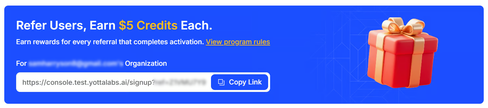

# Reference Program

### Referral Bonus

Referral Bonus are rewards you earn by inviting others to join Yotta Labs.

When someone signs up using your unique referral link and fits our bonus conditions, your organization will receive credits that can be applied toward your future compute usage on our platform.

#### How Referral Works 

1. **Share Your Referral Link with New Users:**

Access your organization's referral link from your organization's account dashboard and share it with new users to create their own account.

<figure><figcaption></figcaption></figure>


Each organization has one unique Referral Link that is permanently bound to that Org and cannot be changed.


2. **New User Registration:**

When someone clicks your referral link and creates a new Yotta Labs account, they become your referred user.

3. **Activation Requirements:**

&#x20;For the referral to be successful and rewards to be granted, your referred user must meet such thresholds :

* **Top up a total of $5 credits ($2 welcome credit for new users not included)**
* **Consume $2  on compute jobs within 4 weeks of signup**

4. **Earn Referral Bonus**:&#x20;

Once your referred user meets the activation requirements, $5 in Referral Bonus is automatically added to your referral bonus in your organization.

5. **Claim Your Credits**:&#x20;

Click the "Claim" button to convert your Available Bonus into usable compute credits. Once claimed, the amount moves to **Claimed Credits** and adds up to your organization's **Balance** on **Billing** pag&#x65;**.**

<figure><figcaption></figcaption></figure>


Remember, **Available Bonus + Claimed Credits = Total Referral Bonus**.


6. **See your claim history**&#x20;

You can check your the date, amount and currency of your past claiming at the **Claim History** part.

<figure><figcaption></figcaption></figure>


There's no limit to how many users you can refer. So the more you share, the more you can offset your compute costs!

The referred user must consume $2 on compute jobs within the organization of which he/she is the owner.

Anyone belong to the organization can share the link, and all bonus is earned and claimed within the organization account.

Referral counts and bonuses are verified and updated every 48 hours. If your bonuses don't appear immediately in your dashboard, please wait for the system to update.


### Prohibited Activities

Users are strictly prohibited from engaging in fraudulent or abusive behavior to manipulate the referral program:

1. Self-referrals using accounts under the same control or clearly associated with each other
2. Any top-up activities that obviously lack genuine business purposes

> ### _Platform Rights & Legal Disclaimer_
>
> _Yotta Labs reserves the right to protect the integrity of the referral program through appropriate enforcement measures. We may delay credit distribution pending verification, revoke credits that were issued based on fraudulent or non-compliant activities, and suspend or terminate accounts of organizations found to be in violation of program rules. These measures ensure fairness for all legitimate users of the platform._
>
> _All referral rewards are issued exclusively as compute credits for use on the Yotta Labs platform. These credits have no cash value, cannot be exchanged for monetary equivalent, and do not constitute income, commission, or any form of taxable compensation. Yotta Labs reserves the right to modify program terms, adjust reward structures, or terminate the referral program at any time without prior notice._
