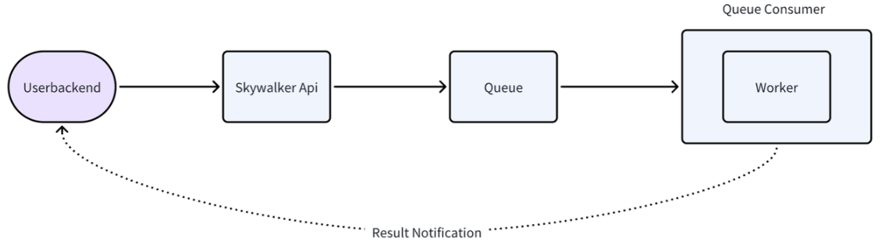
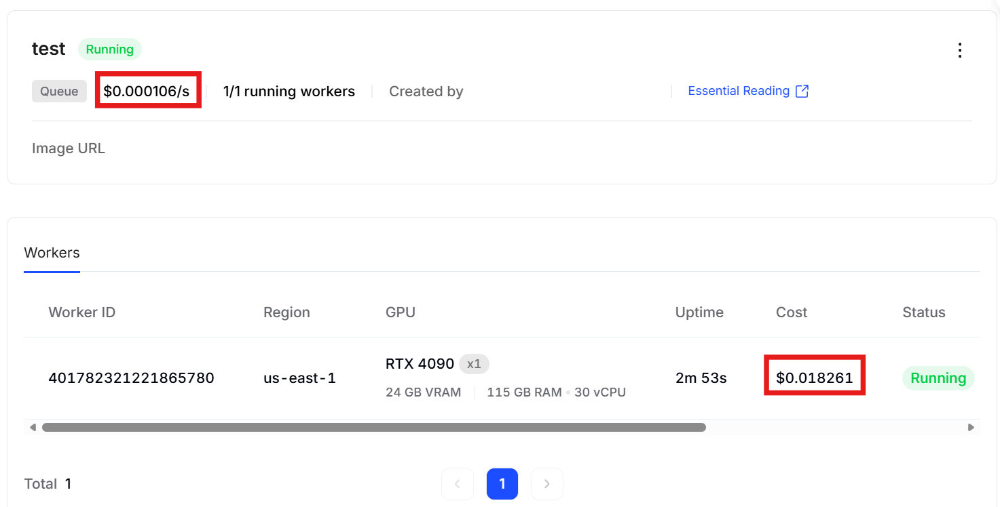
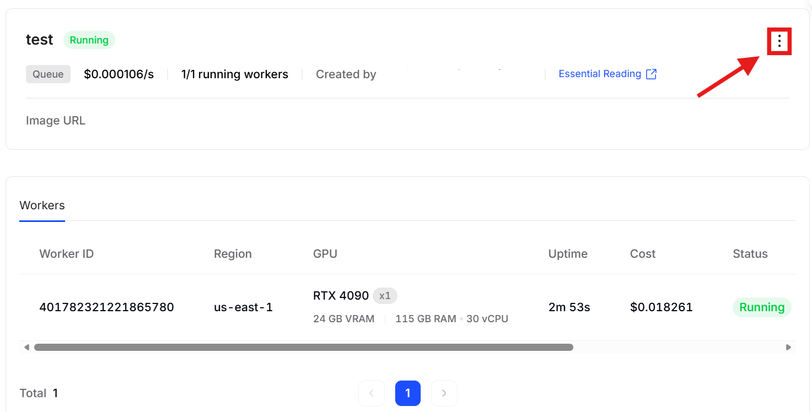
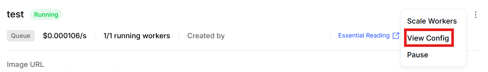
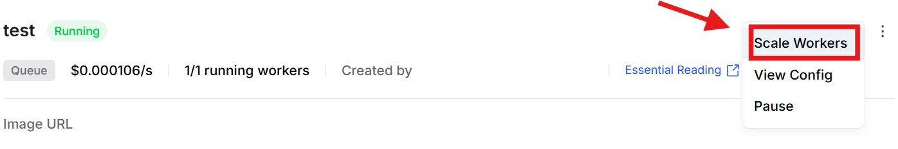
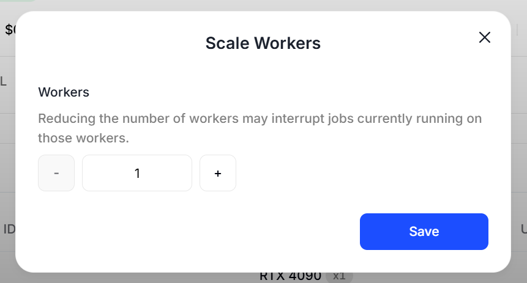
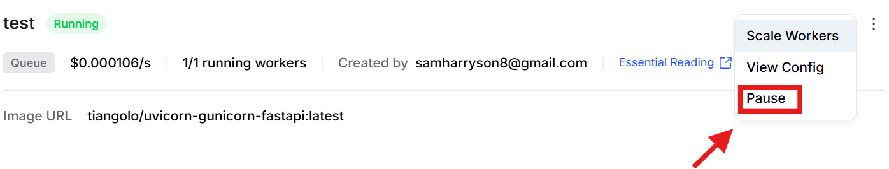
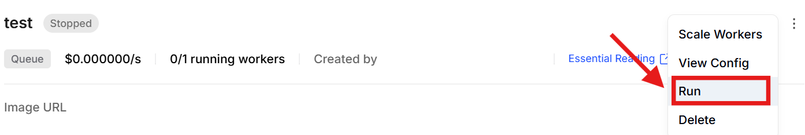
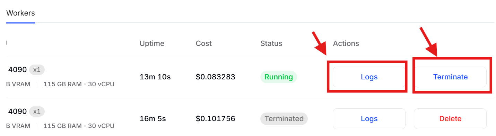

# Queue-based

### Key Features

<figure><figcaption></figcaption></figure>

#### 🚀 Elastic Scaling

Queue Mode automatically adjusts the number of active workers based on incoming request volume. When queue load increases, additional workers are provisioned; when demand decreases, excess workers are automatically terminated to save costs.

#### 💰 Transparent Pricing

* **Per-second billing**: Pay only for actual compute time use.
* **No idle charges**: Workers only incur costs while actively processing requests

<figure><figcaption></figcaption></figure>

For more details in price and billing, see [Pricing & Billing | Yotta Labs](https://docs.yottalabs.ai/yotta-labs/products/elastic-deployment/pricing-and-billing)

### Architecture

#### Queue System

The intelligent queue sits at the center of the architecture, managing:

* Request buffering during traffic spikes
* Load distribution across available workers
* Health checks and automatic failover
* Priority-based request handling

#### Worker Management

* **On-demand provisioning**: Workers spin up in seconds when needed
* **Resource isolation**: Each worker operates in a dedicated, secure environment
* **Status monitoring**: Real-time visibility into worker health and performance

### Getting Started

**1. Configure Your Container**

See [Launching a Deployment | Yotta Labs](https://docs.yottalabs.ai/yotta-labs/products/elastic-deployment/launching-a-deployment)

**2.View/Edit/Clone Configurations**

<figure><figcaption></figcaption></figure>

<figure><figcaption></figcaption></figure>

It would guide you back to configuration setting page. Try cloning or editing by clicking buttons at the bottom (editing is only available when paused/terminated).

<figure><figcaption></figcaption></figure>

**3.Scale Workers**

<figure><figcaption></figcaption></figure>

<figure><figcaption></figcaption></figure>

❗️After you scale workers, price would change accordingly.

**4.Terminate/Run Deployment**

* Terminate

<figure><figcaption></figcaption></figure>

❗️Every time you click `pause` to terminate, the original service would stop. Once restarted, new worker IDs will be assigned, and uptime will reset, counting from zero again.If no volume is mounted, all temporary files and caches will be lost. Resuming the elastic deployment will require reloading the container image and re-downloading the model.

* Run

<figure><figcaption></figcaption></figure>

**5.Terminate Worker /See log**

<figure><figcaption></figcaption></figure>

:exclamation:When there is only one worker in your configuration, you cannot stop any worker using the terminate button shown above. If you'd like to stop it, please pause the deployment.
