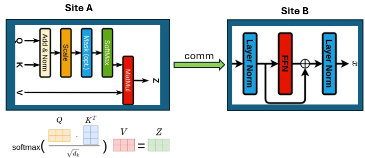
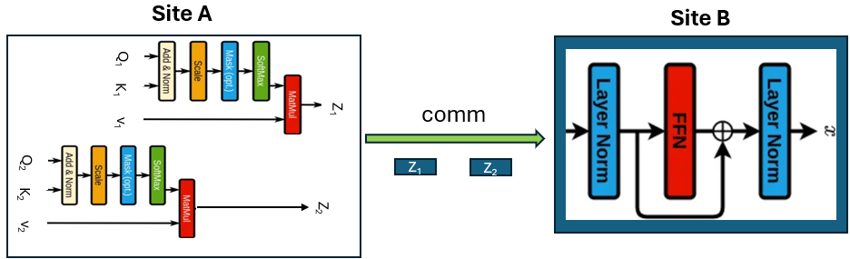
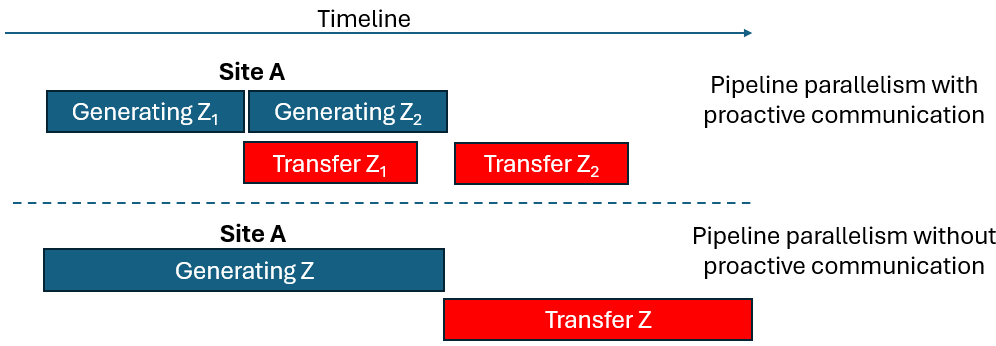

# Proactive Communication

The inter-site communication is a major performance bottleneck in the decentralized system. As the interconnection bandwidth between two sites can be multiple orders of magnitude lower than that in a centralized system, reducing communication overhead is the key to enabling the high performance of Yotta.&#x20;

Using the pipeline parallelism, Yotta overlaps GPU computation with the communication, hiding the communication overhead, shown in the following figure. It's an example of using the traditional pipeline parallelism to run a transformer block in an LLM model on two sites (Site A and Site B). The communication between the two sites can be partially overlapped with the GPU computation on the two sites. However, when the GPU computation on a site is small, the communication overhead cannot be effectively hidden. To address this problem, Yotta uses a technique called proactive communication.

<figure><figcaption></figcaption></figure>

This technique decomposes the original computation and communication operations into finer-grained ones, and transfers each data shard (for communication) whenever it is ready instead of waiting until all of the data shards are ready (the data can be either operands or computation results). The following figure depicts the new parallelism of the pipeline with the computation decomposed into two fine-grained ones to run a transformer block in an LLM model on two sites (Site A and Site B).

<figure><figcaption></figcaption></figure>

The result $$Z_{1}$$ is transferred when it is ready. The transfer of $$Z_{1}$$ overlaps with the generation of $$Z_{2}$$, shown below. We can easily see that using the proactive communication leads to a reduction of the execution time because the data transfer can be overlapped with the computation. In this example, transferring $$Z_{1}$$ overlaps with the computation of generating $$Z_{2}$$.

<figure><figcaption></figcaption></figure>

