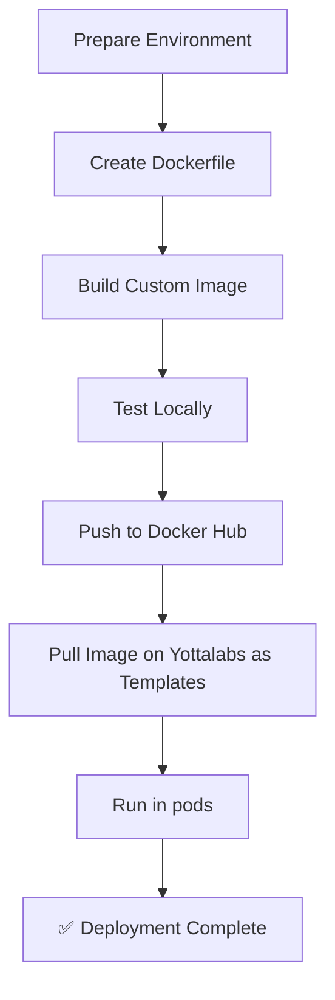

# How to Build Custom Images

## Deployment Overview



***

## Step-by-step Guide



### Prepare a Working Directory

```bash
# Navigate to a proper directory
# For example, this is a working directory "~/projects/tutorial" created on my machine
cd ~/projects
cd tutorial
```



### Create Dockerfile

```bash
# Create Dockerfile and edit it.
nano Dockerfile
```

Dockerfile content:

```dockerfile
# take vllm just as an example here. Replace this line with any image you prefer. Find them on Dockerhub and please keep the formats right ↓
#       vllm       /  vllm-openai  :  latest
# <organize/user> /  <image-name>  :  <tag>
# In most cases, you can simply find official images on Dockerhub as base.
FROM vllm/vllm-openai:latest

# Set environment to avoid interactive prompts
ENV DEBIAN_FRONTEND=noninteractive

# Install OpenSSH server for optional SSH access
# Important! Please don't skip this in order to make sure you have proper ssh connection on our platform.
RUN apt-get update \
    && apt-get install -y openssh-server \
    && apt-get clean \
    && mkdir -p /run/sshd \
    && chmod 755 /run/sshd

# Expose ports for API and SSH
# Port 22 is ALWAYS necessary.
# For which other ports you expose, check the official docs of your project.
EXPOSE 22 <other-ports-you-want-to-expose>
# Example for vllm:
EXPOSE 22 8000
```


Make sure to replace the base image with the one appropriate for your project (found on Docker Hub). Keep the image name and tag format correct.




### Build Docker Image

```bash
# Build the custom image
docker build -t <image-name>:<tag> .
# for instance, in our vllm example:
docker build -t custom:latest .

# Verify image creation
docker images | grep custom
```

Expected output example:

```
REPOSITORY   TAG       IMAGE ID       CREATED        SIZE
custom       latest    a57d0d735be4   5 minutes ago  15.2GB
```



### Test Local Run

```bash
# Run with GPU support
docker run --gpus all -d -p 8000:8000 <image-name>:<tag>

# Or if you use CPU
docker run -d -p 8000:8000 <image-name>:<tag>

# Example:
docker run --gpus all -d -p 8000:8000 custom:latest

# Check container status
docker ps

# View logs
docker logs -f $(docker ps -q)
```

Key log indicators to look for:

* ✅ `vLLM API server version 0.14.0`
* ✅ `Starting vLLM API server 0 on http://0.0.0.0:8000`
* ✅ `Application startup complete`



### Push to Docker Hub

```bash
# Login to Docker Hub (if not logged in)
docker login

# Or general form:
docker tag <image-name>:<tag> <your-user-name>/<image-name-on-dockerhub>:<tag>

# Push to your Docker Hub
docker push <user-name>/vllm-yotta:latest
```



### Create Private Template&#x20;

Visit Compute -> Launch Templates -> Private -> Create

Follow these fields on the Create page:

* Name: Type in a name.
* Registry: Choose Docker Hub.
* Image: Fill in `<your-user-name>/<image-name-on-dockerhub>:<tag>`.
* Command: Example for vllm: `/usr/sbin/sshd -D & vllm serve Qwen/Qwen3-0.6B`
  * /usr/sbin/sshd -D & is necessary to start the SSH service.
  * Add whatever is needed after `&` to initialize your program (check the official project docs for startup commands).
* Environment variables: Add any required env vars (e.g., model\_path, API keys) if needed.
* Ports: Add ports you exposed (e.g., 8000 for vllm).
* Container Disk: Define the container disk size.

Hit Save. You will see a template card — click Deploy to create a pod.



### Verification & Testing

Replace SERVER\_IP with your Yotta Labs server IP.

```bash
# Replace with your Yottalabs server IP
SERVER_IP="12.34.56.78"

# Test connectivity
curl http://$SERVER_IP:8000/v1/models

# Test full API
curl http://$SERVER_IP:8000/v1/chat/completions \
  -H "Content-Type: application/json" \
  -d '{
    "model": "Qwen/Qwen3-0.6B",
    "messages": [
      {"role": "user", "content": "What is the capital of France?"}
    ],
    "max_tokens": 100
  }'
```

Expected successful response for `/v1/models`:

```json
{
  "object": "list",
  "data": [
    {
      "id": "Qwen/Qwen3-0.6B",
      "object": "model",
      "created": 1768965066,
      "owned_by": "vllm",
      "root": "Qwen/Qwen3-0.6B",
      "parent": null,
      "max_model_len": 40960,
      "permission": [...]
    }
  ]
}
```



***

## Additional Resources

* [vLLM Official Documentation](https://docs.vllm.ai/)
* [Docker Documentation](https://docs.docker.com/)
* [NVIDIA Container Toolkit](https://docs.nvidia.com/datacenter/cloud-native/container-toolkit)

***
