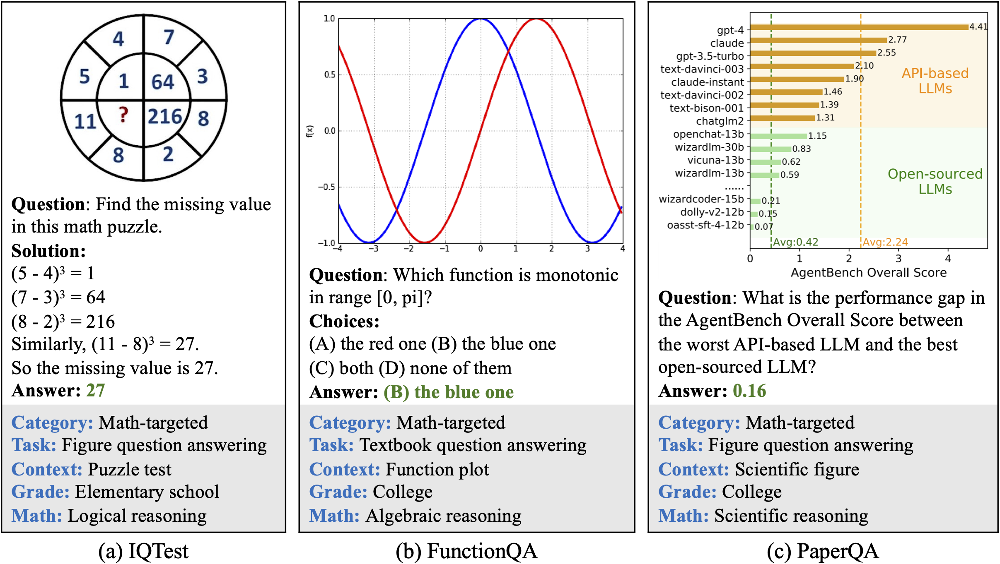

# GRPO on MathVista with Unsloth

> :sloth:This tutorial is created based on [Unsloth official notebooks](https://unsloth.ai/docs/get-started/unsloth-notebooks).&#x20;

**Model:** Qwen3-VL-8B-Instruct (4-bit QLoRA)\
**Algorithm:** Group Relative Policy Optimization\
**Task:** Teaching a VLM to solve math problems from images

### What Are We Solving?

We train the model to answer visual math questions like these:

<figure><figcaption></figcaption></figure>

The model must look at an image, reason about it, and output a numeric answer in a structured format.

***

### Why GRPO on a VLM?

Standard supervised fine-tuning (SFT) requires ground-truth reasoning traces. GRPO instead uses **reward signals** — we only need the final answer label, and the model learns _how_ to reason on its own. This is the same technique used to build o1-style thinking models.

| Method   | Needs reasoning traces? | Sample efficiency |
| -------- | ----------------------- | ----------------- |
| SFT      | ✅ Yes                   | Moderate          |
| **GRPO** | ❌ No                    | High              |

***

## Section 1 — YottaLabs Platform&#x20;

Before running any code in this notebook, you need to spin up a  vitrual machine on YottaLabs.&#x20;



#### Recommended GPU Configuration

<table><thead><tr><th>GPU</th><th width="128">VRAM</th><th>Speed vs A100</th><th>Recommended?</th><th>Note</th></tr></thead><tbody><tr><td><strong>H100 80GB</strong></td><td>80 GB</td><td>2×</td><td>⭐ <strong>Best</strong></td><td>Plenty of headroom, fastest training</td></tr></tbody></table>


**TL;DR:** Use **1× H100 80GB**. With 4-bit QLoRA the model uses \~25 GB, giving you lots of room.




#### Launch the VM&#x20;

To get started with our VM , see our [official doc](https://docs.yottalabs.ai/products/virtual-machines/launching-a-virtual-machine)



***

## Section 2 — Environment Setup


✅ **Run all remaining cells inside your YottaLabs Pod** (via Jupyter at `http://<POD_IP>:8888`).


The YottaLabs base image already has **PyTorch 2.8 + CUDA 12.8** pre-installed. We only need to add the Unsloth fine-tuning stack on top.

```python
# Install Unsloth and the full training stack
# This takes ~2-3 minutes on first run

%%capture
import os, re
!pip install unsloth
!pip install transformers==4.57.0
!pip install --no-deps trl==0.26.2

print("\n✅ All dependencies installed successfully!")

```

```python
# Verify GPU is available and check VRAM
import torch

assert torch.cuda.is_available(), "❌ No GPU detected — check your Pod configuration!"

gpu_name  = torch.cuda.get_device_name(0)
vram_gb   = torch.cuda.get_device_properties(0).total_memory / 1e9
vram_free = torch.cuda.mem_get_info()[0] / 1e9

print(f"✅ GPU:       {gpu_name}")
print(f"   Total VRAM: {vram_gb:.1f} GB")
print(f"   Free VRAM:  {vram_free:.1f} GB")

if vram_gb < 40:
    print("⚠️  WARNING: < 40 GB VRAM detected. Reduce num_generations to 2 and keep load_in_4bit=True.")
else:
    print("   This GPU has plenty of headroom for Qwen3-VL 8B GRPO training! 🚀")

```

***

## Section 3 — Load Qwen3-VL 8B with QLoRA

We load **Qwen3-VL-8B-Instruct** in **4-bit quantization** (QLoRA). This reduces the model's memory footprint from \~16 GB (BF16) to \~5 GB, while preserving most of the model's capability.

### Key Parameters Explained

| Parameter                | Value | Why                                                               |
| ------------------------ | ----- | ----------------------------------------------------------------- |
| `max_seq_length`         | 16384 | VLMs need long context for image tokens (\~1000 tokens per image) |
| `load_in_4bit`           | True  | QLoRA — reduces VRAM from \~16 GB to \~5 GB                       |
| `gpu_memory_utilization` | 0.85  | Leave 15% buffer for GRPO rollout buffers                         |
| `fast_inference`         | False | Disable vLLM for training (enable only for inference-only use)    |

```python
from unsloth import FastVisionModel
import torch
max_seq_length = 16384 # Must be this long for VLMs
lora_rank = 16 # Larger rank = smarter, but slower

model, tokenizer = FastVisionModel.from_pretrained(
    model_name = "unsloth/Qwen3-VL-8B-Instruct-unsloth-bnb-4bit",
    max_seq_length = max_seq_length,
    load_in_4bit = True, # False for LoRA 16bit
    fast_inference = False, # Enable vLLM fast inference
    gpu_memory_utilization = 0.8, # Reduce if out of memory

)

print("\n✅ Model loaded!")
print(f"   Model dtype:  {model.dtype}")
print(f"   VRAM used:    {torch.cuda.memory_allocated() / 1e9:.2f} GB")

```

### Attach LoRA Adapters

Instead of fine-tuning all 8B parameters, LoRA injects small trainable matrices into the attention and MLP layers. Only these adapter weights are updated during training — the base model stays frozen in 4-bit.

**Why freeze the vision encoder?**\
`finetune_vision_layers = False` — The vision encoder (which converts images to tokens) is already well-trained and generalises well. Training it risks overfitting on a small dataset and uses extra VRAM.

```python
model = FastVisionModel.get_peft_model(
    model,
    # Which components to fine-tune:
    finetune_vision_layers     = False,   # Keep vision encoder frozen (saves VRAM, prevents overfit)
    finetune_language_layers   = True,    # Fine-tune the LLM decoder layers ✅
    finetune_attention_modules = True,    # Fine-tune attention (Q, K, V, O projections) ✅
    finetune_mlp_modules       = True,    # Fine-tune feed-forward MLP blocks ✅

    # LoRA hyperparameters:
    r                          = LORA_RANK,        # Adapter rank — higher = more capacity
    lora_alpha                 = LORA_RANK,        # Scale factor; keeping alpha == r is recommended
    lora_dropout               = 0,                # Dropout on LoRA weights (0 = disabled, works best)
    bias                       = "none",           # Don't add bias terms to adapters

    # Other:
    random_state               = 3407,
    use_rslora                 = False,            # Rank-stabilized LoRA (try True for rank > 32)
    loftq_config               = None,
    use_gradient_checkpointing = "unsloth",        # Unsloth's memory-efficient checkpointing
)


print(f"✅ LoRA adapters attached!")
print(f"   Trainable params: {trainable:,}  ({100*trainable/total:.2f}% of total)")
print(f"   Total params:     {total:,}")
print(f"   VRAM used:        {torch.cuda.memory_allocated() / 1e9:.2f} GB")

```

## Section 4 — Prepare the MathVista Dataset

[MathVista](https://mathvista.github.io/) is a benchmark of math problems that require understanding visual context (charts, geometry diagrams, tables, etc.). We use the `testmini` split (\~1000 examples) as our training set.

### Data Pipeline

```
Raw MathVista
     │
     ▼  filter: keep only numeric answers
     │         (regression task — float comparison)
     ▼  preprocess: resize to 512×512, convert to RGB
     │
     ▼  format: wrap in Qwen3-VL chat template
     │          with <REASONING> and <SOLUTION> tags
     ▼
Train Dataset (ready for GRPOTrainer)
```

### Why 512×512?

The original images vary in size. Resizing to a fixed 512×512:

* Keeps image token count predictable (\~1000 tokens per image)
* Prevents sequence length from exceeding `max_seq_length`
* Speeds up training (smaller feature maps in the vision encoder)



#### Step 1 — Load the dataset

```python
from datasets import load_dataset
from trl import GRPOConfig, GRPOTrainer

dataset = load_dataset("AI4Math/MathVista", split = "testmini")

```



#### Step 2 — Keep only numeric answers and preprocess images

```python
# Step 1: Keep only numeric answers
# GRPO uses exact float comparison for the correctness reward.
# Text answers like "blue" or "triangle" can't be compared numerically.

def is_numeric_answer(example):
    try:
        float(example["answer"])
        return True
    except:
        return False

dataset = dataset.filter(is_numeric_answer)

```

```python
# Step 2: Resize images to 512×512 and ensure RGB format
# This keeps token count consistent and avoids memory spikes on large images.
def resize_images(example):
    image = example["decoded_image"]
    image = image.resize((512, 512))
    example["decoded_image"] = image
    return example
dataset = dataset.map(resize_images)

# Then convert to RGB
def convert_to_rgb(example):
    image = example["decoded_image"]
    if image.mode != "RGB":
        image = image.convert("RGB")
    example["decoded_image"] = image
    return example
dataset = dataset.map(convert_to_rgb)

print(f"✅ Images preprocessed: {len(dataset)} examples")
print(f"   Image size: {dataset[0]['decoded_image'].size}")
print(f"   Image mode: {dataset[0]['decoded_image'].mode}")

```



#### Step 3 — Build the prompt template

We use a structured output format with XML-style tags to make it easy for reward functions to parse the model's response:

```
<REASONING>
  ... model's step-by-step working ...
</REASONING>
<SOLUTION>3.14</SOLUTION>
```

This is similar to DeepSeek-R1's `<think>` / `</think>` format. The two-part structure lets us:

1. **Reward format compliance** — did the model produce both tags?
2. **Reward correctness** — is the number inside `<SOLUTION>` correct?

```python
# Define the delimiter variables for clarity and easy modification
REASONING_START = "<REASONING>"
REASONING_END = "</REASONING>"
SOLUTION_START = "<SOLUTION>"
SOLUTION_END = "</SOLUTION>"

def make_conversation(example):
    # Define placeholder constants if they are not defined globally
    # The user's text prompt
    text_content = (
        f"{example['question']}. Also first provide your reasoning or working out"\
        f" on how you would go about solving the question between {REASONING_START} and {REASONING_END}"
        f" and then your final answer between {SOLUTION_START} and (put a single float here) {SOLUTION_END}"
    )

    # Construct the prompt in the desired multi-modal format
    prompt = [
        {
            "role": "user",
            "content": [
                {"type": "image"},  # Placeholder for the image
                {"type": "text", "text": text_content},  # The text part of the prompt
            ],
        },
    ]
    # The actual image data is kept separate for the processor
    return {"prompt": prompt, "image": example["decoded_image"], "answer": example["answer"]}

train_dataset = dataset.map(make_conversation)

# We're reformatting dataset like this because decoded_images are the actual images
# The "image": example["decoded_image"] does not properly format the dataset correctly

# 1. Remove the original 'image' column
train_dataset = train_dataset.remove_columns("image")

# 2. Rename 'decoded_image' to 'image'
train_dataset = train_dataset.rename_column("decoded_image", "image")
```



***

## Section 5 — Design Reward Functions

Reward functions are the heart of GRPO. Instead of manually labelling reasoning traces, we define two automatic signals that tell the model what "good" looks like:

### Reward 1 — Format Compliance (`formatting_reward_func`)

Checks whether the response contains **exactly one** `<REASONING>...</REASONING>` block and **exactly one** `<SOLUTION>...</SOLUTION>` block.

| Condition                                    | Points   |
| -------------------------------------------- | -------- |
| Has exactly 1 `<REASONING>` block            | +1.0     |
| Has exactly 1 `<SOLUTION>` block             | +1.0     |
| >50% of output is `addCriterion` / `\n` spam | −2.0     |
| **Max possible**                             | **+2.0** |

### Reward 2 — Correctness (`correctness_reward_func`)

Checks whether the number inside `<SOLUTION>` exactly matches the ground-truth answer.

| Condition                   | Points |
| --------------------------- | ------ |
| Answer matches ground truth | +2.0   |
| Answer is wrong or missing  | 0.0    |

### Total Reward Range: −2.0 to +4.0

The model learns to maximise this sum across its GRPO rollouts.


**What is the `addCriterion` penalty?**\
Qwen-VL models have a known degenerate mode where they repeat `addCriterion` and newlines endlessly instead of generating meaningful text. The penalty shuts this down early.


```python
# Reward functions
import re

def formatting_reward_func(completions,**kwargs):
    import re
    thinking_pattern = f'{REASONING_START}(.*?){REASONING_END}'
    answer_pattern = f'{SOLUTION_START}(.*?){SOLUTION_END}'

    scores = []
    for completion in completions:
        if isinstance(completion, list):
            completion = completion[0]["content"] if completion else ""
        score = 0
        thinking_matches = re.findall(thinking_pattern, completion, re.DOTALL)
        answer_matches = re.findall(answer_pattern, completion, re.DOTALL)
        if len(thinking_matches) == 1:
            score += 1.0
        if len(answer_matches) == 1:
            score += 1.0

        # Fix up addCriterion issues
        # See https://unsloth.ai/docs/new/vision-reinforcement-learning-vlm-rl#qwen-2.5-vl-vision-rl-issues-and-quirks
        # Penalize on excessive addCriterion and newlines
        if len(completion) != 0:
            removal = completion.replace("addCriterion", "").replace("\n", "")
            if (len(completion)-len(removal))/len(completion) >= 0.5:
                score -= 2.0

        scores.append(score)
    return scores


def correctness_reward_func(prompts, completions, answer, **kwargs) -> list[float]:
    answer_pattern = f'{SOLUTION_START}(.*?){SOLUTION_END}'

    completions = [(c[0]["content"] if c else "") if isinstance(c, list) else c for c in completions]
    responses = [re.findall(answer_pattern, completion, re.DOTALL) for completion in completions]
    q = prompts[0]
    print('-'*20, f"Question:\n{q}", f"\nAnswer:\n{answer[0]}", f"\nResponse:{completions[0]}")
    return [
        2.0 if len(r)==1 and a == r[0].replace('\n','') else 0.0
        for r, a in zip(responses, answer)
    ]

print(f"  Good response score:  {formatting_reward_func([test_good])}  (expected [2.0])")
print(f"  Missing tags score:   {formatting_reward_func([test_bad])}   (expected [0.0])")
print(f"  Spam response score:  {formatting_reward_func([test_spam])}  (expected [-2.0])")

```

***

## Section 6 — Pre-Training Baseline Inference

Before training, let's run the model on a sample problem to establish a **baseline**. This shows us what the model can already do, and gives us a qualitative benchmark to compare against after training.

```python
image = train_dataset[100]["image"]
prompt = train_dataset[100]["prompt"]

inputs = tokenizer(
    image,
    prompt,
    add_special_tokens = False,
    return_tensors = "pt",
).to("cuda")

from transformers import TextStreamer
text_streamer = TextStreamer(tokenizer, skip_prompt = True)
_ = model.generate(**inputs, streamer = text_streamer, max_new_tokens = 1024,
                   use_cache = True, temperature = 1.0, min_p = 0.1)
```


Use `%pip install "jinja2>=3.1.0"` if there are any compatible errors.


***

## Section 7 — Configure & Launch GRPO Training

### How GRPO Works (Briefly)

For each training step, GRPO:

1. **Samples** `num_generations` completions from the current policy (the model)
2. **Scores** each completion with the reward functions
3. **Updates** the policy to increase the probability of high-reward completions relative to the group mean

This is fundamentally different from PPO (which needs a separate value network) — GRPO only needs the policy model, making it much more memory-efficient.

### GSPO Extension (Enabled Here)

We also enable **GSPO (Group Sequence Policy Optimisation)** via:

* `importance_sampling_level = "sequence"` — importance weights at sequence level
* `loss_type = "dr_grpo"` — doubly robust GRPO loss

This improves training stability, especially for long completions typical of VLMs.

### Key Hyperparameters

| Parameter                     | Value       | Effect                                                   |
| ----------------------------- | ----------- | -------------------------------------------------------- |
| `learning_rate`               | 5e-6        | Small LR — RL is sensitive to overshooting               |
| `num_generations`             | 4           | More rollouts = better gradient estimate (H100 has room) |
| `per_device_train_batch_size` | 1           | VLMs are memory-heavy; batch=1 is standard               |
| `gradient_accumulation_steps` | 4           | Effective batch of 4 without extra VRAM                  |
| `max_grad_norm`               | 0.1         | Gradient clipping — critical for RL stability            |
| `optim`                       | adamw\_8bit | 8-bit Adam: same quality, half the optimizer state VRAM  |
| `num_train_epochs`            | 1.0         | Full pass over the dataset (\~600 steps)                 |

```python
from trl import GRPOConfig, GRPOTrainer
training_args = GRPOConfig(
    learning_rate = 5e-6,
    adam_beta1 = 0.9,
    adam_beta2 = 0.99,
    weight_decay = 0.1,
    warmup_ratio = 0.1,
    lr_scheduler_type = "cosine",
    optim = "adamw_8bit",
    logging_steps = 1,
    log_completions = False,
    per_device_train_batch_size = 1,
    gradient_accumulation_steps = 1, # Increase to 4 for smoother training
    num_generations = 2, # Decrease if out of memory
    max_prompt_length = 1024,
    max_completion_length = 1024,
    num_train_epochs = 0.5, # Set to 1 for a full training run
    # max_steps = 60,
    save_steps = 60,
    max_grad_norm = 0.1,
    report_to = "none", # Can use Weights & Biases
    output_dir = "outputs",

    # Below enables GSPO:
    importance_sampling_level = "sequence",
    mask_truncated_completions = False,
    loss_type = "dr_grpo",
)

print("✅ Training configuration set!")
print(f"   Output dir:       {OUTPUT_DIR}")
print(f"   Epochs:           {training_args.num_train_epochs}")
print(f"   Num generations:  {training_args.num_generations}")
print(f"   Effective batch:  {training_args.per_device_train_batch_size * training_args.gradient_accumulation_steps}")
print(f"   Max grad norm:    {training_args.max_grad_norm}")

```

```python
trainer = GRPOTrainer(
    model = model,
    args = training_args,
    # Pass the processor to handle multimodal inputs
    processing_class = tokenizer,
    reward_funcs = [
        formatting_reward_func,
        correctness_reward_func,
    ],
    train_dataset = train_dataset,
)
print("✅ GRPOTrainer initialised. Starting training ...")
print("   (You will see reward values logged each step)")
print("   Watch for 'rewards/formatting' and 'rewards/correctness' to increase over time.\n")
trainer.train()
print("\n🎉 Training complete!")

```

<figure><figcaption></figcaption></figure>

***

## Section 8 — Post-Training Inference

Now let's run the same inference test as Section 6, but with the trained model. You should see:

1. **Structured output** — the model reliably uses `<REASONING>` and `<SOLUTION>` tags
2. **Better accuracy** — the numeric answer inside `<SOLUTION>` should be closer to correct
3. **Coherent reasoning** — the `<REASONING>` block should show sensible working-out steps

```python
image = train_dataset[165]["image"]
prompt = train_dataset[165]["prompt"]

inputs = tokenizer(
    image,
    prompt,
    add_special_tokens = False,
    return_tensors = "pt",
).to("cuda")

from transformers import TextStreamer
text_streamer = TextStreamer(tokenizer, skip_prompt = True)
_ = model.generate(**inputs, streamer = text_streamer, max_new_tokens = 1024,
                   use_cache = True, temperature = 1.0, min_p = 0.1)

```

***

## Section 9 — Save & Export

There are several ways to save the trained model depending on your use case:

| Method                 | File size | Use case                                  |
| ---------------------- | --------- | ----------------------------------------- |
| **LoRA adapters only** | \~100 MB  | Fine-tune further, share on HuggingFace   |
| **Merged 16-bit**      | \~16 GB   | Deploy with vLLM or standard transformers |
| **Merged 4-bit**       | \~5 GB    | Memory-constrained deployment             |
| **GGUF q4\_k\_m**      | \~5 GB    | llama.cpp / Ollama local inference        |
| **GGUF f16**           | \~16 GB   | llama.cpp high-quality inference          |

```python
import os
LORA_SAVE_DIR = "/workspace/grpo_lora"
os.makedirs(LORA_SAVE_DIR, exist_ok=True)

# ── Option 1: Save LoRA adapters only (recommended — smallest, most flexible) ─
print("Saving LoRA adapters ...")
model.save_pretrained(LORA_SAVE_DIR)
tokenizer.save_pretrained(LORA_SAVE_DIR)
print(f"✅ LoRA adapters saved to: {LORA_SAVE_DIR}")

# List saved files
import subprocess
result = subprocess.run(f"ls -lh {LORA_SAVE_DIR}", shell=True, capture_output=True, text=True)
print(result.stdout)

```

```python
# ── Option 2: Push LoRA adapters to HuggingFace Hub ─────────────────────────
# Uncomment and fill in your username/token to publish the model

# import os
# HF_TOKEN = os.environ.get("HF_TOKEN", "YOUR_TOKEN_HERE")
# model.push_to_hub("your_username/qwen3vl-8b-mathvista-grpo", token=HF_TOKEN)
# tokenizer.push_to_hub("your_username/qwen3vl-8b-mathvista-grpo", token=HF_TOKEN)
# print("✅ Model pushed to HuggingFace Hub!")

# ── Option 3: Merge to full 16-bit and save locally ───────────────────────────
# WARNING: This requires ~16 GB disk space. Uncomment to use.

# model.save_pretrained_merged("/workspace/model_merged_16bit", tokenizer, save_method="merged_16bit")
# print("✅ Merged 16-bit model saved!")

# ── Option 4: Export to GGUF (for llama.cpp / Ollama) ───────────────────────
# model.save_pretrained_gguf("/workspace/model_gguf", tokenizer, quantization_method="q4_k_m")
# print("✅ GGUF model saved!")

print("Uncomment the block you need above and re-run this cell.")

```


***
