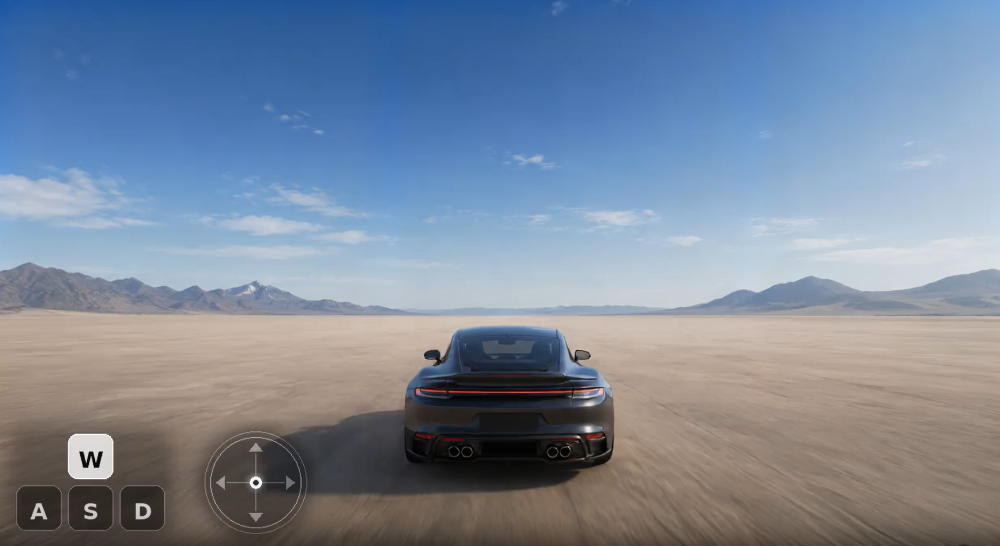

# SANA-WM: Deploying NVIDIA's World Model on a Single RTX Pro 6000


> **TL;DR:** SANA-WM is a brand-new 2.6B open-source world model from NVIDIA that generates 720p, 60-second videos from a single image and a camera trajectory — on a single GPU. Its distilled variant, running with NVFP4 quantization, produces a full one-minute clip in 34 seconds on a single RTX 5090. This guide walks you through what the paper is actually saying and gets the model running on a Yotta Labs Pod.

***

Before we start the deployment, let's talk about world models — or more specifically, the practical problem that's been quietly blocking their adoption.

The idea of a world model is pretty compelling: give the system one image, a text description, and a camera path, and it synthesizes a coherent, explorable video of that world. This is exactly the kind of building block you'd want for embodied AI, robotics simulation, game engine prototyping, or any scenario where you need to generate spatially consistent environments at scale. The research momentum has been building for years, and we've seen some impressive results from both academic groups and big labs.

But here's the catch: most competitive world models are painfully expensive to run. LingBot-World, for instance, uses 14B+14B parameters and requires 8 GPUs just for inference. HY-WorldPlay similarly needs a multi-GPU setup. These aren't hobbyist tools — they're industrial systems that most teams can't realistically deploy, iterate on, or experiment with. And even if you can afford the compute, the throughput is often dismal: LingBot-World manages about 0.6 videos per hour on 8 H100s. That's not a pipeline; that's a waiting game.

The NVIDIA research team behind SANA-WM asked a pointed question: do we actually need all that? Can we build a world model that's natively efficient — not as an afterthought, but as the core design principle — and still hit industrial-quality output?

The short answer is yes. The long answer is what this tutorial is about.

***

### What SANA-WM Is and Why It Matters

SANA-WM ([arXiv:2605.15178](https://arxiv.org/abs/2605.15178), released May 14 2026) is a 2.6B-parameter Diffusion Transformer trained natively to generate 60-second, 720p video with 6-DoF camera control. It's built on the SANA-Video codebase, fully open-source under Apache 2.0, and — crucially — runs on a single GPU.

For context, the full benchmark comparison looks like this:

| Model                 | Params   | Resolution | GPUs needed | Throughput       |
| --------------------- | -------- | ---------- | ----------- | ---------------- |
| LingBot-World         | 14B+14B  | 480p       | 8           | 0.6 vids/hr      |
| HY-WorldPlay          | 8B       | 480p       | 8           | 1.1 vids/hr      |
| Matrix-Game 3.0       | 5B       | 720p       | 8           | 3.1 vids/hr      |
| **SANA-WM + refiner** | **2.6B** | **720p**   | **1**       | **22.0 vids/hr** |

That 36× throughput advantage over LingBot-World, at comparable visual quality, with better camera accuracy, on a fraction of the hardware — that's not a marginal improvement. It's a genuinely different operating regime.

***

### How It Actually Works: The Four Core Ideas

The paper leans on four architectural decisions that compound on each other. Let's walk through them honestly.

**Hybrid Linear Attention with Gated DeltaNet (GDN).** The fundamental problem with generating 60-second 720p video is the sequence length. At 720p, a 60-second clip produces 961 latent frames. Standard softmax attention scales quadratically with sequence length — meaning your memory requirements explode long before you hit a minute of video. SANA-Video (the predecessor) tried to solve this with cumulative ReLU-based linear attention, which keeps a fixed-size recurrent state. That works, but it has no forgetting mechanism: every past frame accumulates with equal weight, causing the model to drift badly on long sequences.

SANA-WM replaces most attention blocks with frame-wise Gated DeltaNet (GDN). The key difference from how GDN is used in language models is that here, each recurrent step processes an entire latent frame rather than a single token. The GDN update incorporates two corrections: a decay gate γ that down-weights stale past frames, and a delta-rule update that only corrects the residual between what the state predicts and what the target actually is. The result is a state that stays D×D in memory regardless of how long the video gets. Training stability required one more fix: keys are scaled by 1/√(D·S) where S is the number of spatial tokens per frame — without this, training diverges (NaN at step 1, literally). The final model uses 20 transformer blocks total: 15 GDN blocks and 5 softmax attention blocks placed at layers 3, 7, 11, 15, and 19, where long-range spatial recall really matters.

**Dual-Branch Camera Control.** Getting a model to faithfully follow a 6-DoF camera trajectory is harder than it sounds. A text description of motion is fuzzy; an actual metric-scale trajectory is precise. SANA-WM uses two branches operating at different temporal resolutions. The coarse branch runs at the latent-frame rate — it computes a ray-local camera basis from the camera-to-world pose and intrinsics, then applies Unified Camera Positional Encoding (UCPE) to the geometric channels of each attention head. This captures the global trajectory structure. But there's a compression mismatch: each latent token actually summarizes eight raw video frames, each of which has its own distinct camera pose. The coarse branch can't see this intra-stride motion at all. So the fine branch computes pixel-wise Plücker raymaps (a 6D representation encoding ray direction and moment) from all eight raw frames within each temporal stride, packs them into a 48-channel tensor, and injects this after every self-attention output through a zero-initialized projection. The ablation is pretty clear: UCPE alone gets a Camera Motion Consistency (CamMC) of 0.2453; adding Plücker mixing brings it to 0.2047, the best among all compared methods.

**Two-Stage Generation Pipeline.** Stage-1 outputs are temporally consistent but can accumulate structural artifacts over the full 60-second span. The second-stage refiner addresses this. It starts from the 17B LTX-2 model with rank-384 LoRA adapters applied to attention and feedforward projections — LoRA-only fine-tuning keeps things tractable compared to optimizing the full 17B model. At inference, stage-1 latents are perturbed with a large starting noise (σ\_start = 0.9), and the refiner learns to map this noisy input toward the high-fidelity target using only 3 Euler denoising steps. The impact on long-horizon visual drift (ΔIQ) is significant: it drops from 3.79 to 1.17 on simple trajectories and from 3.09 to 0.31 on hard ones. The practical workflow the authors suggest is to use stage-1 to search for good trajectories quickly, then selectively refine the promising ones.

**Robust Data Annotation Pipeline.** Training camera-controlled generation requires metric-scale 6-DoF pose annotations — something most public video datasets simply don't provide. The team modified VIPE, an existing pose annotation engine, replacing its depth backend with Pi3X (for long-sequence-consistent 3D structure) fused with MoGe-2 (for accurate per-frame metric scale). They also extended bundle adjustment to treat focal lengths and principal points as per-frame variables rather than global constants, which matters a lot for internet video where the camera and lens change. The final training set is 212,975 clips from seven sources including SpatialVID-HQ, DL3DV (real and GS-rendered), OmniWorld, and MiraData — all with metric-scale pose supervision.

Training ran in two phases on 64 H100 GPUs over roughly 18.5 days total (3.5 days of VAE adaptation, then four progressive DiT training stages from 5-second clips up to 60-second sequences with camera control, distillation, and attention-sink deployment). Custom fused Triton kernels for the GDN operations contribute roughly 1.5–2× throughput gains throughout.

***

### The Results

On the paper's purpose-built 60-second world-model benchmark (80 scenes across game, indoor, outdoor-city, and outdoor-nature categories, evaluated on both simple and hard camera trajectory splits), SANA-WM with the second-stage refiner achieves:

* **Best camera accuracy** among all compared methods: rotation error of 4.50°/8.34° and CamMC of 1.41/1.44 (Simple/Hard) — beating LingBot-World (14B+14B) and HY-WorldPlay (8B) on both splits
* **Comparable visual quality** to LingBot-World at 80.62/81.89 VBench Overall vs LingBot's 81.82/81.89
* **36× higher throughput**: 22.0 videos/hour on 8 H100s vs LingBot's 0.6
* **Memory**: full pipeline fits in 74.7 GB; stage-1 only needs 51.1 GB — within a single H100's budget

The distilled variant, specifically targeted at consumer hardware, runs on a single RTX 5090 with NVFP4 quantization and produces a 60-second 720p clip in 34 seconds. That's the variant we're deploying in this tutorial.

***

### Try SANA-WM Yourself

This is a step-by-step guide to getting it running on a Yotta Labs RTX Pro 6000 Pod — **first-frame image in, camera trajectory in, 720p video world out.** Let's go.

> **A note on the refiner:** The full pipeline includes an LTX-2 refiner that polishes the output, but it requires downloading an additional \~40 GB of weights on top of the base model. For this tutorial we're running Stage 1 only with `--no_refiner`, which uses the Sana VAE to decode directly. Quality is solid, and you save yourself a lot of download time and disk space.

***



### Set Up Your Pod

In the [Yotta Labs Console](https://console.yottalabs.ai/), go to **Compute → Pods → Deploy** and select **RTX Pro 6000**. Configure it as follows:

| Setting   | Value |
| --------- | ----- |
| GPU Count | **1** |

Add your Hugging Face token as an environment variable before deploying:

```
HF_TOKEN=<your_huggingface_token>
```

Once the Pod shows **Running**, connect to JupyterLab and open a terminal.



### Clone and Install&#x20;

```bash
git clone https://github.com/NVlabs/Sana.git
cd Sana

# Fix setuptools before running setup (setuptools 70+ breaks mmcv)
pip install "setuptools<70" --force-reinstall

bash ./environment_setup.sh sana
conda init bash && source ~/.bashrc
conda activate sana

pip install torchvision
pip install -e .
```



### Download Model Weights


Here's where things get a little tricky. The default inference script fetches everything from HuggingFace automatically — but that includes the LTX-2 refiner (37.8 GB), which will fill your disk before you even get to inference. We'll download only what we actually need: the config, the Stage-1 DiT, and the VAE.

```bash
hf download Efficient-Large-Model/SANA-WM_bidirectional \
  config.yaml \
  dit/sana_wm_1600m_720p.safetensors \
  "vae/diffusion_pytorch_model.safetensors" \
  "vae/config.json" \
  --local-dir ./checkpoints/SANA-WM
```

This downloads about 13 GB total and takes a couple of minutes. Once it's done, there's one more fix needed: the `config.yaml` points the VAE path to `hf://`, which would trigger a full repo download again at runtime. Patch it to use the local path instead:

```bash
sed -i 's|vae_pretrained: hf://Efficient-Large-Model/SANA-WM_bidirectional|vae_pretrained: /home/user/Sana/checkpoints/SANA-WM|' \
  ./checkpoints/SANA-WM/config.yaml

# Verify the fix
grep "vae_pretrained" ./checkpoints/SANA-WM/config.yaml
```

You should see:

```
vae_pretrained: /home/user/Sana/checkpoints/SANA-WM
```



### Run Inference

Everything's in place. Let's generate a world:

```bash
python inference_video_scripts/inference_sana_wm.py \
  --image asset/sana_wm/demo_0.png \
  --prompt asset/sana_wm/demo_0.txt \
  --action "w-80,jw-40,w-40,lw-60,w-100" \
  --translation_speed 0.055 \
  --rotation_speed_deg 1.2 \
  --num_frames 321 \
  --output_dir results/demo \
  --config ./checkpoints/SANA-WM/config.yaml \
  --model_path ./checkpoints/SANA-WM/dit/sana_wm_1600m_720p.safetensors \
  --no_refiner
```

The output MP4 will appear in `results/demo/`. You can download it directly from the JupyterLab file browser.

**What the camera action string means:** `"w-80,jw-40,w-40,lw-60,w-100"` is a sequence of WASD-style moves — forward 80 frames, then rotate-left + forward for 40 frames, forward 40 frames, pan-left 60 frames, forward 100 frames. The full key reference:

| Key       | Movement            |
| --------- | ------------------- |
| `w` / `s` | Forward / Backward  |
| `a` / `d` | Pan left / right    |
| `j` / `l` | Rotate left / right |
| `i` / `k` | Tilt up / down      |

Combine keys freely — `jw` means rotate-left and move forward simultaneously.



### Try the Other Built-in Demos

The repo ships three demo scenes — each with a matching image, prompt, and precomputed camera trajectory. They're a great way to explore the model's range before bringing in your own content.

* **demo\_0** — A black sports car on a vast dry lakebed, bright midday desert light
* **demo\_1** — Mouth of a dark limestone cave in dense forest, blue fireflies leading into a golden chamber
* **demo\_2** — A magical mushroom forest at purple-gold twilight, a small robot on the path ahead

To run demo\_1 or demo\_2, swap the index and pass the precomputed `--camera` and `--intrinsics` files instead of `--action`:

```bash
# demo_1: cave scene
python inference_video_scripts/inference_sana_wm.py \
  --image asset/sana_wm/demo_1.png \
  --prompt asset/sana_wm/demo_1.txt \
  --camera asset/sana_wm/demo_1_pose.npy \
  --intrinsics asset/sana_wm/demo_1_intrinsics.npy \
  --num_frames 321 \
  --output_dir results/demo_1 \
  --name demo_1 \
  --config ./checkpoints/SANA-WM/config.yaml \
  --model_path ./checkpoints/SANA-WM/dit/sana_wm_1600m_720p.safetensors \
  --no_refiner

# demo_2: mushroom forest
python inference_video_scripts/inference_sana_wm.py \
  --image asset/sana_wm/demo_2.png \
  --prompt asset/sana_wm/demo_2.txt \
  --camera asset/sana_wm/demo_2_pose.npy \
  --intrinsics asset/sana_wm/demo_2_intrinsics.npy \
  --num_frames 321 \
  --output_dir results/demo_2 \
  --name demo_2 \
  --config ./checkpoints/SANA-WM/config.yaml \
  --model_path ./checkpoints/SANA-WM/dit/sana_wm_1600m_720p.safetensors \
  --no_refiner
```

The `.npy` pose files contain precomputed camera-to-world matrices (shape `(F, 4, 4)`) and intrinsics (shape `(3, 3)`), which give more precise trajectories than the WASD action string.



### Use Your Own Image and Prompt

Ready to generate your own scene? Here's what you need.

**Your image.** Any PNG or JPG — the model auto-resizes and center-crops to **704 × 1280**. Landscape orientation with a clear sense of depth works best. Avoid heavily cropped faces or abstract textures as the first frame.

**Your prompt.** Save it as a `.txt` file. The demo prompts are a good style reference — they describe the scene environment in detail (surfaces, lighting, atmosphere, spatial layout) and note that the camera is stationary while the world itself moves. You don't need to be as verbose, but a few sentences of scene context noticeably improves temporal consistency.

**Your camera trajectory.** Use the WASD/IJKL action string for quick experimentation:

| Key       | Movement           | Key       | Movement            |
| --------- | ------------------ | --------- | ------------------- |
| `w` / `s` | Forward / Backward | `j` / `l` | Rotate left / right |
| `a` / `d` | Pan left / right   | `i` / `k` | Tilt up / down      |

Combine keys freely — `jw` means rotate-left and move forward simultaneously.

```bash
python inference_video_scripts/inference_sana_wm.py \
  --image /path/to/your/image.png \
  --prompt /path/to/your/prompt.txt \
  --action "w-100,rw-60,w-80" \
  --translation_speed 0.05 \
  --rotation_speed_deg 1.0 \
  --num_frames 161 \
  --output_dir results/my_scene \
  --name my_scene \
  --config ./checkpoints/SANA-WM/config.yaml \
  --model_path ./checkpoints/SANA-WM/dit/sana_wm_1600m_720p.safetensors \
  --no_refiner
```

**Key parameters to tune:**

| Parameter              | What it does                    | Suggested range                   |
| ---------------------- | ------------------------------- | --------------------------------- |
| `--num_frames`         | Video length at 16 fps          | 161 ≈ 10s · 321 ≈ 20s · 961 ≈ 60s |
| `--translation_speed`  | Camera movement speed per frame | 0.03 – 0.08                       |
| `--rotation_speed_deg` | Rotation degrees per frame      | 0.5 – 2.0                         |
| `--step`               | DiT denoising steps             | 30 (fast) – 60 (default)          |
| `--cfg_scale`          | Prompt adherence strength       | 3.0 – 7.0                         |
| `--flow_shift`         | Scheduler flow shift            | 8.0 – 10.0                        |

If you get a `FOV outside [25°, 120°]` error, the model couldn't reliably estimate camera intrinsics from your image. Try a different starting image with clearer perspective depth, or pass `--intrinsics` explicitly with a `(3, 3)` numpy array.&#x20;



### See the Result

<figure><figcaption></figcaption></figure>





### Troubleshooting

**Disk fills up during download.** You likely triggered a full repo snapshot download. Stop the process, run `rm -rf ~/.cache/huggingface/hub/`, and use the selective download commands in Step 3 instead.

**`OSError: No space left on device` during inference.** Check `df -h` — if `/var` is at 100%, clear the HuggingFace cache: `rm -rf ~/.cache/huggingface/hub/`. The selective download in Step 3 only needs \~13 GB total.

**`vae_pretrained` still points to `hf://` after the patch.** Double-check the sed command ran successfully with `grep "vae_pretrained" ./checkpoints/SANA-WM/config.yaml`. If it still shows the `hf://` path, edit the file manually: `nano ./checkpoints/SANA-WM/config.yaml` and replace line 5.

**OOM during inference.** Try reducing `--num_frames` to `161` first. If still OOM, add `--offload_vae` to move the VAE to CPU between encode/decode steps.

***

_Model:_ [_Efficient-Large-Model/SANA-WM\_bidirectional_](https://huggingface.co/Efficient-Large-Model/SANA-WM_bidirectional) _· Paper:_ [_arXiv:2605.15178_](https://arxiv.org/abs/2605.15178) _· GitHub:_ [_NVlabs/Sana_](https://github.com/NVlabs/Sana)

