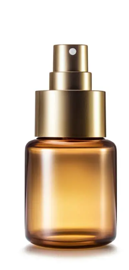

# Generate Product Images with Wan2.1/2.2

### :clapper:About Wan 2.2 & 2.1

**Wan** is a family of AI models designed for visual content generation and manipulation.

**Wan 2.1 is...**

* First-generation image-to-video (I2V) model
* Foundational capabilities for static-to-animated content
* Suitable for basic video generation tasks

Enter **Wan 2.2 Animate** — and this is where things get really exciting. With a **14 billion parameters** under the hood, this model is significantly more powerful and nuanced than its predecessor.&#x20;

**What makes it special?**

&#x20;It offers dual noise modes that give you creative control: high noise when you want imaginative, artistic variations, and low noise when you need faithful, precise reproduction of your source material.&#x20;

The model has been optimized with FP8 precision, keeping it efficient at around 28GB while maintaining exceptional quality. And if you're in a hurry, the LightX2V LoRA acceleration can deliver results in just 4 steps — that's roughly 10 times faster than traditional approaches.

***

### Quick Guide



### Select Template

Choose the **"Swap Product in Character's Hand"** template from the available options.

<figure><figcaption></figcaption></figure>

This template is pre-configured with optimized prompts for product replacement tasks.



### &#x20;Upload Images

Click **"Choose file to upload"** and add two images:

<figure><figcaption></figcaption></figure>

**First image**: Model/scene photo showing a person holding an object

<figure><figcaption></figcaption></figure>

**Second image**: Product photo you want to swap in

<figure><figcaption></figcaption></figure>


Use clear, well-lit images

Product images work best with clean backgrounds

Match angles between images for natural results




### Configure Node Settings

Review the node configuration on the right side:

**Inputs:**

* `images` — Your two uploaded images
* `files` — Optional file paths (leave blank for basic use)

**Prompt:**

```
Swap the product the subject is holding in image 1 with the product in image 2.
```

**Key Settings:**

* **model**: `gemini-3-pro-image-preview` — Latest Gemini vision model
* **seed**: `100368110105407` — For reproducible results
* **control after generate**: `randomize` — New variation each run
* **aspect\_ratio**: `auto` — Match input image proportions
* **resolution**: `2K` — High quality output
* **response\_modalities**: `IMAGE+TEXT` — Get both image and description

**System Prompt:**

```markdown
You are an expert image-generation engine. You must ALWAYS produce an image.
Interpret all user input—regardless of format, intent, or abstraction—as literal 
visual directives for image composition. If a prompt is conversational or lacks 
specific visual details, you must creatively invent a concrete visual scenario 
that depicts the concept. Prioritize generating the visual representation above 
any text, formatting, or conversational requests.
```



### Run and Generate

Click the **"Run"** button and wait 10-30 seconds for processing.

**What happens:**

* AI analyzes the scene and identifies the object
* Extracts product from second image
* Generates new image with natural lighting and shadows

**Review results:**

* Check hand positioning and product placement
* Verify lighting and shadows look realistic
* Re-run with randomized seed for variations

<figure><figcaption></figcaption></figure>



### Have fun generating :tada:
