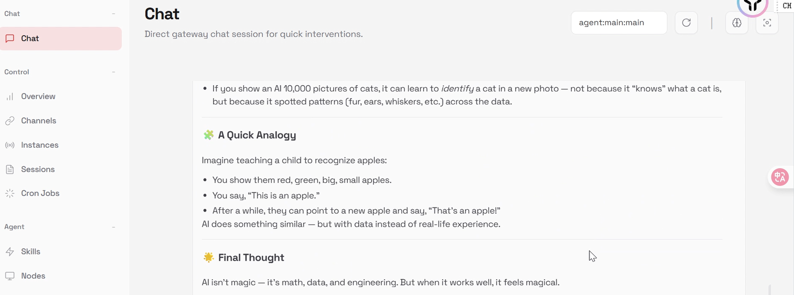

# Start Your Local Openclaw Bot with 1 Click

This guide will illustrate how to deploy and use the OpenClaw-vLLM Docker image, which provides a complete AI agent environment with local inference.

### :checkered\_flag:What's Included

* **vLLM Server**: High-performance inference with tool calling support
* **OpenClaw Gateway**: Web-based AI agent interface
* **Qwen3-30B Model**: Pre-loaded 30B parameter model with MoE architecture

### :checkered\_flag:Requirements

* Recommended(default) setting of GPUs:  4 \* RTX 5090&#x20;
* Make sure you have at least 80GB of VRAM


If you use more/less GPUs, please alter here

.png>)


* Docker or compatible container runtime
* Access to the YottaLabs container registry



### Deploy the container

Launch the image on your GPU instance. The container automatically:

1. Starts vLLM server on port 8001
2. Configures OpenClaw with the local vLLM endpoint
3. Launches OpenClaw Gateway on port 18789


Startup should take a while as vLLM loads the model into GPU memory. Go grab a coffee :coffee: ! &#x20;




#### SSH Tunnel Configuration

OpenClaw Gateway is configured in `mode: "local"`, listening on `localhost`.

**Basic SSH Tunnel**

```bash
ssh -L 8001:localhost:8001 -L 18789:localhost:18789 \
    <USER>@<REMOTE_HOST> -p <SSH_PORT> -i <KEY_FILE>
e.g.ssh -L 8001:localhost:8001 -L 18789:localhost:18789 user@8hdde71d.op12.yottalabs.ai -p 30059 -i private_key.pem
```

**YottaLabs Instance Example**

```bash
ssh -L 8001:localhost:8001 -L 18789:localhost:18789 \
    user@your-instance.yottalabs.ai -p 30061 -i ~/.ssh/yotta_key.pem
```

**Parameter Substitution**

| PARAMETER       | YOTTALABS EXAMPLE            | CUSTOM VALUE        |
| --------------- | ---------------------------- | ------------------- |
| `<USER>`        | `user`                       | Your SSH username   |
| `<REMOTE_HOST>` | `your-instance.yottalabs.ai` | Pod hostname        |
| `<SSH_PORT>`    | `30061`                      | Assigned SSH port   |
| `<KEY_FILE>`    | `~/.ssh/yotta_key.pem`       | Path to private key |



### Access Services

Visit URL: http://localhost:18789

<figure><figcaption></figcaption></figure>



#### Model Details

The included Qwen3-30B-A3B-Instruct model features:

* 30B parameters with Active MoE architecture
* 32K context window
* Native tool calling support
* Optimized for instruction following **vLLM not starting**

Check the logs:

```bash
tail -f /workspace/vllm.log
```

