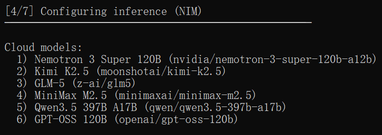

# NemoClaw with Local Inference

**Hardware:** NVIDIA RTX 6000 Ada (48 GB VRAM)

&#x20;**Model:** Qwen3.5-35B-A3B (MoE, Q6\_K quantization, \~138 tok/s)&#x20;

**Stack:** llama.cpp → OpenShell inference routing → OpenClaw agent&#x20;

**Tested:** March23 2026, NemoClaw 2026.3.11, OpenShell 0.0.13

***

### How It Works

Before diving in, it helps to understand the data flow. The OpenClaw sandbox is an isolated Kubernetes pod — it cannot reach the host directly. All outbound traffic is routed through an OpenShell proxy at `10.200.0.1:3128`, which intercepts `https://inference.local` and forwards it to whatever backend you have configured.

```
OpenClaw agent
      ↓
https://inference.local
      ↓  (intercepted by OpenShell proxy at 10.200.0.1:3128)
OpenShell gateway  (privacy router — injects credentials, rewrites model)
      ↓
llama-server on host  (your GPU, your model)
      ↓
Qwen3.5-35B-A3B  (MoE, 3B active params per token)
```

Two things matter here that are easy to get wrong:

1. **Do not bypass the proxy.** `inference.local` only resolves through the OpenShell proxy. Using `--noproxy` or pointing OpenClaw directly at a host IP will time out.
2. **Use `https://`, not `http://`.** The proxy only intercepts HTTPS traffic on `inference.local`.

***

### Prerequisites

| REQUIREMENT    | NOTES                                                                       |
| -------------- | --------------------------------------------------------------------------- |
| OS             | Ubuntu 22.04 or 24.04                                                       |
| GPU            | NVIDIA RTX 6000 Ada (48 GB VRAM)                                            |
| CUDA           | 12.0+                                                                       |
| Docker         | Engine 24+ with NVIDIA Container Toolkit                                    |
| Node.js        | v18+                                                                        |
| Disk           | \~50 GB free                                                                |
| NVIDIA account | API key from [build.nvidia.com](https://build.nvidia.com/settings/api-keys) |

***

### Part 1 — Install NemoClaw

```bash
# Install Node.js 20
curl -fsSL https://deb.nodesource.com/setup_20.x | bash -
apt-get install -y nodejs
​
# Install NemoClaw CLI
npm install -g nemoclaw
```

Run the onboarding wizard. It will ask for your NVIDIA API key and a cloud model — pick anything, you will replace it with the local model in Part 5.

```bash
nemoclaw onboard
```

If you hit a port conflict on 18789:

```bash
kill $(lsof -ti:18789)
nemoclaw onboard
```

At step 4, just choose a random model here as we'll use a local model by configuring manually.

<figure><figcaption></figcaption></figure>

Accept the suggested presets (pypi, npm) when prompted. When onboarding finishes:

```bash
openshell sandbox list
# NAME          NAMESPACE  PHASE
# my-assistant  openshell  Ready
```

***

### Part 2 — Build llama.cpp

```bash
apt-get update && apt-get install -y cmake build-essential aria2 tmux
```

```bash
git clone https://github.com/ggerganov/llama.cpp
cd llama.cpp
```

RTX 6000 Ada is Ada Lovelace — compile with `sm_89`. The `GGML_CUDA_FA_ALL_QUANTS` flag is required for Flash Attention to work with quantized KV caches.

```bash
cmake -B build \
  -DGGML_CUDA=ON \
  -DGGML_CUDA_FA_ALL_QUANTS=ON \
  -DCMAKE_CUDA_ARCHITECTURES="89" \
  -DCMAKE_BUILD_TYPE=Release
​
cmake --build build --config Release -j$(nproc)
```

Compilation takes 5–10 minutes. Done when you see `[100%] Built target llama-server`.

> **Architecture reference:** Blackwell (RTX 5090) → `120`, Ampere (A100/A40/RTX 3090) → `80`, Turing (RTX 2080) → `75`

***

### Part 3 — Download the Model

With 48 GB of VRAM, Q6\_K gives you near-FP16 accuracy at \~27 GB. Q4\_K\_XL is faster if you want to trade a bit of quality for throughput.

If you use a RTX 4090, use the Q4\_K\_XL to avoid OOM problems.

```bash
mkdir -p ~/llama.cpp/models
​
# Recommended: Q6_K (~27 GB, near-FP16 quality)
aria2c -x16 -s16 -k 1M \
  "https://huggingface.co/unsloth/Qwen3.5-35B-A3B-GGUF/resolve/main/Qwen3.5-35B-A3B-UD-Q6_K_XL.gguf" \
  -d ~/llama.cpp/models/ \
  -o Qwen3.5-35B-A3B-UD-Q6_K_XL.gguf
​
# Alternative: Q4_K_XL (~19 GB, faster)
# aria2c -x16 -s16 -k 1M \
#   "https://huggingface.co/unsloth/Qwen3.5-35B-A3B-GGUF/resolve/main/Qwen3.5-35B-A3B-UD-Q4_K_XL.gguf" \
#   -d ~/llama.cpp/models/ \
#   -o Qwen3.5-35B-A3B-UD-Q4_K_XL.gguf
​
```

***

### Part 4 — Start llama-server

Run this in a tmux session so it survives terminal disconnects.

```bash
tmux new -s llama
```

Inside tmux, start the server. The `--jinja` flag is critical — it enables the model's built-in Jinja chat template, which outputs OpenAI-compatible JSON tool calls. Without it, any agent request that triggers a tool call will fail with a parse error.

```bash
cd ~/llama.cpp
​
./build/bin/llama-server \
  -m ./models/Qwen3.5-35B-A3B-UD-Q6_K_XL.gguf \
  --ctx-size 32768 \
  --cache-type-k q8_0 \
  --cache-type-v q8_0 \
  --flash-attn on \
  -ngl 99 \
  --host 0.0.0.0 \
  --port 9090 \
  --jinja
```

For Q4\_K\_XL, use this command:

```bash
cd ~/llama.cpp
​
./build/bin/llama-server \
  -m ./models/Qwen3.5-35B-A3B-UD-Q4_K_XL.gguf \
  --ctx-size 16384 \
  --cache-type-k q4_0 \
  --cache-type-v q4_0 \
  --flash-attn on \
  -ngl 99 \
  --host 0.0.0.0 \
  --port 9090 \
  --jinja
```


\--jinja is an important variable!


Detach from tmux with `Ctrl+B D`. The server keeps running in the background.

Wait for the model to load (you will see `server is listening on http://0.0.0.0:9090`), then verify:

```bash
curl http://127.0.0.1:9090/v1/models
```

You should get back JSON listing the model. If it times out, give it another 30 seconds — first load takes a moment.

***

### Part 5 — Register the Local Inference Provider

This is where OpenShell learns about your llama-server. Use the host's public IP — `127.0.0.1` does not work because requests originate from inside the gateway container.

```bash
# Get your host's public IP
ip addr show eth0 | grep "inet " | awk '{print $2}' | cut -d/ -f1
```

```bash
openshell provider create \
  --name llama-local \
  --type openai \
  --credential OPENAI_API_KEY=none \
  --config OPENAI_BASE_URL=http://<YOUR_HOST_IP>:9090/v1
```

Set the inference route. Use `--no-verify` because `host.openshell.internal` resolves differently inside the gateway than from your host shell.

```bash
openshell inference set \
  --provider llama-local \
  --model Qwen3.5-35B-A3B-UD-Q6_K_XL.gguf \
  --no-verify
```

Confirm it saved:

```bash
openshell inference get
# Provider: llama-local
# Model:    Qwen3.5-35B-A3B-UD-Q6_K_XL.gguf
# Version:  3
```

***

### Part 6 — Configure OpenClaw

OpenClaw reads its config from `/sandbox/.openclaw/openclaw.json` inside the pod. The file is owned by root and read-only from inside the sandbox, so write it from the host via kubectl.

First, grab your gateway auth token:

```bash
docker exec openshell-cluster-nemoclaw kubectl exec -n openshell my-assistant -- \
  python3 -c "import json; d=json.load(open('/sandbox/.openclaw/openclaw.json')); print(d['gateway']['auth']['token'])"
```

Then write the updated config — replace `YOUR_GATEWAY_TOKEN` with the value above:

```bash
docker exec openshell-cluster-nemoclaw kubectl exec -n openshell my-assistant -- python3 -c "
import json
config = {
  'wizard': {'lastRunAt': '2026-03-23T09:47:00.000Z', 'lastRunVersion': '2026.3.11', 'lastRunCommand': 'doctor', 'lastRunMode': 'local'},
  'models': {
    'mode': 'merge',
    'providers': {
      'llama-local': {
        'baseUrl': 'https://inference.local/v1',
        'apiKey': 'unused',
        'api': 'openai-completions',
        'models': [{
          'id': 'Qwen3.5-35B-A3B-UD-Q6_K_XL.gguf',
          'name': 'Qwen3.5-35B-A3B',
          'reasoning': True,
          'input': ['text'],
          'cost': {'input': 0, 'output': 0, 'cacheRead': 0, 'cacheWrite': 0},
          'contextWindow': 32768,
          'maxTokens': 4096
        }]
      }
    }
  },
  'agents': {'defaults': {'model': {'primary': 'llama-local/Qwen3.5-35B-A3B-UD-Q6_K_XL.gguf'}}},
  'commands': {'native': 'auto', 'nativeSkills': 'auto', 'restart': True, 'ownerDisplay': 'raw'},
  'channels': {'defaults': {}},
  'gateway': {
    'mode': 'local',
    'controlUi': {'allowedOrigins': ['http://127.0.0.1:18789'], 'allowInsecureAuth': True, 'dangerouslyDisableDeviceAuth': True},
    'auth': {'token': 'YOUR_GATEWAY_TOKEN'},
    'trustedProxies': ['127.0.0.1', '::1']
  },
  'meta': {'lastTouchedVersion': '2026.3.11', 'lastTouchedAt': '2026-03-23T09:47:00.000Z'}
}
open('/sandbox/.openclaw/openclaw.json', 'w').write(json.dumps(config, indent=2))
print('done')
"
```

Replace `Qwen3.5-35B-A3B-UD-Q6_K_XL.gguf` with `Qwen3.5-35B-A3B-UD-Q4_K_XL.gguf` if you use a RTX 4090.

Verify the write:

```bash
docker exec openshell-cluster-nemoclaw kubectl exec -n openshell my-assistant -- \
  cat /sandbox/.openclaw/openclaw.json | grep baseUrl
# "baseUrl": "https://inference.local/v1"
```

***

### Part 7 — Test

Connect to the sandbox:

```bash
openshell sandbox connect my-assistant
```

Test the inference endpoint directly.


&#x20;Do not use `--noproxy` — the proxy needs to intercept this request.


```bash
curl https://inference.local/v1/chat/completions \
  -H "Content-Type: application/json" \
  -d '{"messages":[{"role":"user","content":"hello"}],"max_tokens":100}'
```

You should get a JSON response from Qwen3.5 within a few seconds. Then test the OpenClaw agent:

```bash
openclaw agent --agent main --local \
  -m "hello, what model are you?" \
  --session-id test
```

Expected output:

```bash
I'm running on llama-local/Qwen3.5-35B-A3B-UD-Q6_K_XL.gguf.
That's a Qwen3.5 model (35B parameters) running locally in this sandbox.
```

If this returns a proper response without a `Failed to parse input` error, the full stack is working.

***

### Performance

Measured on RTX 6000 Ada (48 GB, Ada Lovelace sm\_89):

| QUANTIZATION | MODEL SIZE | SPEED           | QUALITY                 |
| ------------ | ---------- | --------------- | ----------------------- |
| Q4\_K\_XL    | \~19 GB    | \~120–140 tok/s | Good                    |
| Q6\_K        | \~27 GB    | \~120–140 tok/s | Very good (recommended) |
| Q8\_0        | \~36 GB    | \~50–70 tok/s   | Excellent               |

Q6\_K and Q4\_K\_XL are close in speed because Qwen3.5-35B-A3B is a MoE model — only 3B parameters activate per token regardless of the 35B total. The bottleneck is memory bandwidth, not parameter count.

***

### Known Issues and Workarounds

#### Tool call parse error: `Failed to parse input at pos N: <tool_call>`

Qwen3.5 defaults to its own XML-style tool call format. OpenClaw expects OpenAI-compatible JSON. Fix: add `--jinja` to the llama-server startup command. This enables the model's built-in Jinja template which outputs proper JSON tool calls.

#### `inference.local` returns DNS resolution error

You used `--noproxy` with curl, or accessed `inference.local` over `http://` instead of `https://`. The OpenShell proxy only intercepts HTTPS. Drop `--noproxy` and use `https://`.

#### `openshell inference set` times out during verification

The gateway resolves `host.openshell.internal` differently than your host shell does. Use `--no-verify` to skip the probe and save the config anyway.

#### `openshell policy set` fails with "filesystem policy cannot be removed"

Known Alpha bug in OpenShell 0.0.13. Dynamic policy updates always fail with this error even when the YAML only contains `network_policies`. Workaround: edit the static policy file at `~/.nemoclaw/source/nemoclaw-blueprint/policies/openclaw-sandbox.yaml` and re-run `nemoclaw onboard`.

#### `openclaw config set inference.*` fails with "Unrecognized key"

OpenClaw 2026.3.11 does not recognize the `inference` config key. Write `openclaw.json` directly using the kubectl method in Part 6.

#### Provider base URL with `127.0.0.1` or `localhost` does not work

The provider request originates from inside the gateway container. Use the host's actual public IP.

***

### Configuration Reference

#### llama-server flags

| FLAG              | VALUE     | WHY                                                            |
| ----------------- | --------- | -------------------------------------------------------------- |
| `--host`          | `0.0.0.0` | Must bind all interfaces, not just loopback                    |
| `--port`          | `9090`    | Any free port works                                            |
| `-ngl`            | `99`      | Offload all layers to GPU                                      |
| `--ctx-size`      | `32768`   | 32K context; increase with Q4 KV cache for longer contexts     |
| `--cache-type-k`  | `q8_0`    | High-quality KV cache; use `q4_0` for very long contexts       |
| `--cache-type-v`  | `q8_0`    | Same                                                           |
| `--flash-attn on` | —         | Required for quantized KV cache                                |
| `--jinja`         | —         | **Required** — enables OpenAI-compatible JSON tool call format |

#### openclaw.json provider block

```json
{
  "models": {
    "mode": "merge",
    "providers": {
      "llama-local": {
        "baseUrl": "https://inference.local/v1",
        "apiKey": "unused",
        "api": "openai-completions",
        "models": [{
          "id": "Qwen3.5-35B-A3B-UD-Q6_K_XL.gguf",
          "name": "Qwen3.5-35B-A3B",
          "reasoning": true,
          "input": ["text"],
          "cost": { "input": 0, "output": 0, "cacheRead": 0, "cacheWrite": 0 },
          "contextWindow": 32768,
          "maxTokens": 4096
        }]
      }
    }
  },
  "agents": {
    "defaults": {
      "model": {
        "primary": "llama-local/Qwen3.5-35B-A3B-UD-Q6_K_XL.gguf"
      }
    }
  }
}
```

#### cmake flags by GPU architecture

```bash
# Ada Lovelace (RTX 6000 Ada, RTX 4090)
cmake -B build -DGGML_CUDA=ON -DGGML_CUDA_FA_ALL_QUANTS=ON \
  -DCMAKE_CUDA_ARCHITECTURES="89" -DCMAKE_BUILD_TYPE=Release
​
# Blackwell (RTX 5090)
cmake -B build -DGGML_CUDA=ON -DGGML_CUDA_FA_ALL_QUANTS=ON \
  -DCMAKE_CUDA_ARCHITECTURES="120" -DCMAKE_BUILD_TYPE=Release
​
# Ampere (A100, A40, RTX 3090)
cmake -B build -DGGML_CUDA=ON -DGGML_CUDA_FA_ALL_QUANTS=ON \
  -DCMAKE_CUDA_ARCHITECTURES="80" -DCMAKE_BUILD_TYPE=Release
```

***

### Quick Reference

```bash
# ── Host: start llama-server ──────────────────────────────────────
tmux new -s llama -d
tmux send-keys -t llama "cd ~/llama.cpp && ./build/bin/llama-server \
  -m ./models/Qwen3.5-35B-A3B-UD-Q6_K_XL.gguf \
  --ctx-size 32768 --cache-type-k q8_0 --cache-type-v q8_0 \
  --flash-attn on -ngl 99 --host 0.0.0.0 --port 9090 --jinja" Enter
​
# ── Host: verify llama-server is up ───────────────────────────────
curl http://127.0.0.1:9090/v1/models
​
# ── Host: connect to sandbox ──────────────────────────────────────
openshell sandbox connect my-assistant
​
# ── Sandbox: test inference (no --noproxy) ────────────────────────
curl https://inference.local/v1/chat/completions \
  -H "Content-Type: application/json" \
  -d '{"messages":[{"role":"user","content":"hello"}],"max_tokens":100}'
​
# ── Sandbox: run agent ────────────────────────────────────────────
openclaw agent --agent main --local -m "your prompt here" --session-id test
​
# ── Sandbox: exit ─────────────────────────────────────────────────
exit
```

